# Configurable Finance Operations Agent Platform

A configuration-driven multi-agent platform for finance operations using SAP data, Excel, CSV, PDF documents, and other enterprise sources.

The platform is designed around six reusable capability agents, a deterministic workflow orchestrator, a reusable rule engine, a reusable calculation engine, human review, and complete auditability.

The first recommended workflow is **bank-to-GL reconciliation**. The long-term goal is to support approximately 50 finance and selected non-finance use cases without creating a new application or a new custom agent for each one.

---

## 1. Vision

Finance teams work with data spread across SAP, spreadsheets, PDF documents, bank statements, reports, emails, and local files. These sources often have different formats, column names, business rules, and levels of quality.

This platform allows a finance administrator to:

1. Describe a business use case in natural language.
2. Let the LLM suggest an appropriate workflow.
3. Select and configure reusable agents.
4. Connect approved rules and calculation tools.
5. Map different source columns to the same calculation inputs.
6. Test the workflow using sample data.
7. Submit it for approval.
8. Publish a version for users.

The platform uses AI for extraction, interpretation, recommendations, and explanations. It uses deterministic services for calculations, rules, permissions, workflow state, approvals, and audit records.

> Natural language creates a draft. Only validated and approved structured configuration runs in production.

## 1A. Scope and terminology

This README is the product and architecture baseline. It describes the target platform, not a claim that every listed use case is available on day one.

| Term | Meaning |
|---|---|
| Agent | A bounded business capability such as capture, matching, validation, explanation, or human-work coordination. |
| Workflow | A versioned process definition that selects agents, tools, rules, calculations, mappings, and human steps. |
| Workflow run | One execution of a published workflow for a specific input set and reporting context. |
| Capability | A registered agent, rule, calculation, connector, parser, or other approved reusable function. |
| Finance Admin | A finance-aware user who configures published capabilities for a use case. |
| Super Admin | A trusted developer or platform owner who creates and publishes new capabilities. |
| Source snapshot | An immutable copy or reference to the exact input data used by a run. |
| Evidence | Source records, transformations, calculations, rules, decisions, and links supporting an output. |

### Design assumptions

- The initial deployment is on-premises.
- The initial SAP integration is read-only, beginning with approved exports.
- The first production workflow is advisory bank-to-GL reconciliation.
- Human review is required for exceptions; automatic posting is excluded from the MVP.
- The platform supports multiple companies, currencies, and periods only after the canonical model and access boundaries are proven.

---


---

## 2. Core Design Principle

```text
Reusable capability agents
+ Workflow configuration
+ Field mappings
+ Reusable rules
+ Reusable calculations
+ Human review
+ Audit evidence
= Published finance use case
```

The system does not create six completely new AI systems for every use case. It reuses the same capability agents and changes their configuration.

```text
Bank-to-GL reconciliation
= A1 + A2 + A3 + A4 + A5 + A6
  with bank/GL mappings, reconciliation rules, and reconciliation calculations

AP invoice processing
= A1 + A2 + A3 + A4 + A5 + A6
  with invoice/PO mappings, invoice rules, and invoice calculations
```

Not every workflow needs all six agents. The workflow configuration decides which agents participate.

---

## 3. Architecture Overview

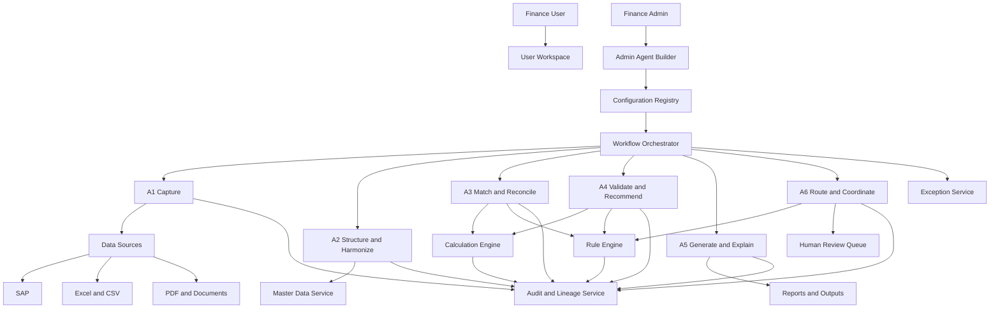

### Main components

| Component | Responsibility |
|---|---|
| A1 Capture | Reads and extracts data from SAP exports, Excel, CSV, PDF, APIs, and future sources. |
| A2 Structure and Harmonize | Converts different source formats into a canonical finance model. |
| A3 Match and Reconcile | Matches, compares, and reconciles related records. |
| A4 Validate and Recommend | Applies calculations, rules, controls, thresholds, and review requirements, then recommends an outcome. |
| A5 Generate and Explain | Produces reports, summaries, explanations, and evidence links. |
| A6 Route and Coordinate | Manages reviewer queues, human decisions, notifications, and escalations. |
| Workflow Orchestrator | Deterministically controls sequence, state, retries, dependencies, and resume behavior. |
| Calculation Engine | Executes approved financial calculations with typed inputs and versioned formulas. |
| Rule Engine | Evaluates reusable technical, finance, and workflow rules. |
| Master Data Service | Provides accounts, entities, vendors, customers, currencies, calendars, and mappings. |
| Exception Service | Creates and manages actionable exceptions and their resolution history. |
| Audit and Lineage Service | Records source data, transformations, tools, rules, decisions, and published versions. |
| Configuration Registry | Stores versioned agent, workflow, rule, calculation, and audit configurations. |

### Canonical finance data model

A2 must produce a shared canonical model. Source columns may differ by file or system, but downstream agents must use stable fields.

Core entities include:

```text
Company
LegalEntity
FiscalPeriod
GLAccount
CostCenter
ProfitCenter
Vendor
Customer
BankAccount
Transaction
Invoice
Payment
JournalEntry
Balance
Currency
DocumentEvidence
```

Example canonical transaction:

```json
{
  "transaction_id": "txn-1001",
  "company_code": "1000",
  "fiscal_period": "2026-08",
  "posting_date": "2026-08-25",
  "amount": 1250.50,
  "currency": "USD",
  "debit_credit": "D",
  "reference": "BANK-123",
  "source_record_id": "bank-file-44-row-18"
}
```

Every canonical value should retain its source record, source field, transformation, confidence, and mapping version.

### Platform service interaction

The following services are shared by every workflow. They are platform services, not additional LLM agents.

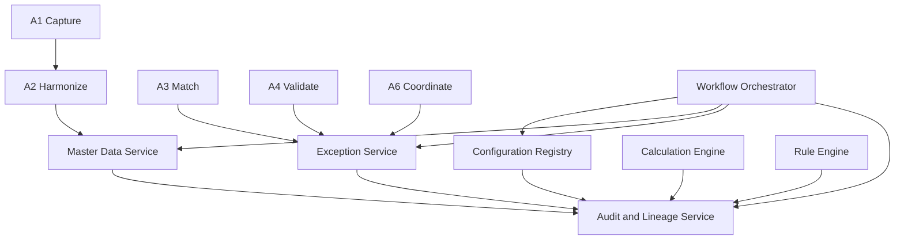

The services have different responsibilities:

```text
Master Data Service       -> What do finance codes and entities mean?
Exception Service         -> What requires human attention?
Audit and Lineage Service -> What happened, why, and with which evidence?
Configuration Registry    -> Which approved version should run?
```

---

## 3A. Master Data Service

The Master Data Service provides trusted reference data used to interpret and validate business records. It prevents each agent or workflow from maintaining its own inconsistent account, vendor, entity, currency, or calendar mappings.

### Master data managed

| Domain | Examples |
|---|---|
| Organization | Company code, legal entity, business unit, country. |
| Accounting | Chart of accounts, GL account, account type, cost center, profit center. |
| Trading partners | Vendor, customer, supplier group, payment terms. |
| Banking | Bank, bank account, account currency, statement format. |
| Time | Fiscal year, fiscal period, posting date, business calendar, holidays. |
| Currency | Currency code, decimal precision, approved exchange-rate source. |
| Procurement | Material, service, purchase-order category, approval group. |
| Security mapping | User, team, entity, company-code, and data-access scope. |

### Responsibilities

- Import or synchronize approved master data from SAP and other systems.
- Provide effective-dated lookups to A2, A3, A4, A6, rules, and calculations.
- Map source codes to canonical values.
- Detect unknown, duplicate, inactive, or conflicting records.
- Preserve the source and ownership of every mapping.
- Support local overrides only when explicitly approved.
- Version changes and apply them according to effective dates.
- Enforce entity and company-code access boundaries.

### Master-data record

```json
{
  "record_type": "gl_account",
  "record_id": "400000",
  "canonical_name": "Product Revenue",
  "company_code": "1000",
  "source_system": "sap",
  "source_key": "400000",
  "status": "active",
  "effective_from": "2026-01-01",
  "effective_to": null,
  "version": 3,
  "owner": "finance_master_data",
  "approved_by": "controller"
}
```

### How agents use it

```text
A1 captures source codes
A2 resolves source codes to canonical master data
A3 uses trusted keys for matching
A4 validates account, entity, currency, and period rules
A6 routes unknown or restricted master-data cases
A5 cites the master-data version used in the output
```

### Admin controls

The Finance Admin can request or configure approved mappings. The Super Admin controls connectors, synchronization, schema, and access enforcement.

The UI should show:

- Source value
- Canonical value
- Mapping confidence
- Mapping owner
- Effective date
- Current status
- Conflicting mappings
- Workflows affected by a change

An unknown account or vendor should become a data-quality exception. The system must not silently invent a master-data mapping.

### Master-data API examples

```text
GET  /master-data/{type}/{key}
POST /master-data/mappings/validate
GET  /master-data/versions
POST /master-data/change-requests
GET  /master-data/impact/{record_id}
```

---

## 3B. Exception Service

The Exception Service is the shared system for anything that cannot be completed automatically or safely. It creates a durable work item that A6 can route to a human reviewer.

### Exception sources

- Invalid or unreadable input file
- Missing required field
- Low-confidence extraction or mapping
- Unknown master-data value
- Unmatched record
- Duplicate record
- Calculation failure
- Rule violation
- Material variance
- Missing evidence
- Unauthorized action
- External connector or MCP/A2A failure

### Responsibilities

- Create a unique exception with a stable business key.
- Store reason, severity, evidence, proposed action, and related records.
- Assign an owner queue and responsible user.
- Expose the item in the reviewer workspace.
- Accept decisions such as accept, reject, correct, request-information, and waive.
- Require comments and evidence for configured overrides.
- Reopen, escalate, merge, or close exceptions.
- Prevent duplicate exceptions during retries.
- Send the authorized decision back to the orchestrator.
- Record the complete resolution history in the Audit Service.

### Exception lifecycle

```text
created -> triaged -> assigned -> in_review
       -> waiting_for_information -> resolved
       -> rejected -> reopened -> resolved
       -> escalated -> cancelled
```

### Exception record

```json
{
  "exception_id": "exc-10045",
  "business_key": "bank_to_gl:1000:2026-08:bank-row-145",
  "run_id": "run-2026-0001",
  "type": "reconciliation_difference",
  "severity": "medium",
  "status": "assigned",
  "owner_queue": "finance_operations",
  "assigned_to": "reviewer-17",
  "reason": "Difference exceeds configured tolerance",
  "evidence": ["bank_row_145", "sap_balance_2026_08"],
  "proposed_action": "Review bank fee or timing difference",
  "required_decision": "accept | reject | correct | request_information",
  "source_configuration_version": 4,
  "created_at": "2026-08-26T10:30:00Z"
}
```

### Exception deduplication

The service should use a business key and run context so a retry does not create a second task for the same problem:

```text
business_key + workflow_version + source_snapshot = one logical exception
```

If the same problem appears in a later period or source snapshot, it becomes a new linked exception rather than overwriting history.

### Exception API examples

```text
POST /exceptions
GET  /exceptions/{exception_id}
GET  /exceptions?queue=finance_operations&status=open
POST /exceptions/{exception_id}/assign
POST /exceptions/{exception_id}/decision
POST /exceptions/{exception_id}/escalate
POST /exceptions/{exception_id}/reopen
```

The Exception Service owns the work item. A6 owns coordination and communication. The orchestrator owns workflow state.

---

## 3C. Audit and Lineage Service

The Audit and Lineage Service records what the platform did, which data it used, why it produced a result, and which human or service made each decision.

It is a mandatory shared service for finance workflows. Audit settings may control detail, masking, and retention, but core evidence cannot be disabled.

### Audit responsibilities

- Record immutable events for sources, transformations, agents, tools, rules, calculations, exceptions, decisions, and workflow transitions.
- Link every output value to source records and derived calculations.
- Record configuration, prompt, model, rule, calculation, tool, and master-data versions.
- Store actor identity, service identity, timestamp, run ID, and correlation ID.
- Support audit search, evidence export, and historical replay.
- Protect events with append-only storage, restricted deletion, retention locks, and optional hashes or signatures.
- Record access to sensitive audit data.

### Audit event envelope

```json
{
  "event_id": "evt-10045",
  "event_type": "calculation_completed",
  "run_id": "run-2026-0001",
  "correlation_id": "corr-7788",
  "actor_type": "service",
  "actor_id": "calculation-engine",
  "workflow_id": "bank_to_gl_reconciliation",
  "workflow_version": 4,
  "agent_id": "A4",
  "capability_id": "calculate_reconciliation_difference",
  "capability_version": 1,
  "input_refs": ["bank_balance:bank_row_200", "gl_balance:sap_balance_2026_08"],
  "output": {"difference": 500.00, "status": "exception"},
  "created_at": "2026-08-26T10:30:00Z"
}
```

### Lineage graph

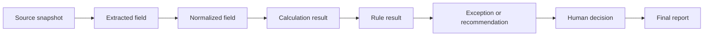

### Audit queries the product must support

```text
Why was this record marked as an exception?
Which source rows produced this report number?
Which formula and rule versions were used?
Who changed the tolerance and who approved it?
Which user accepted this match?
What changed between two workflow runs?
Can this historical result be replayed?
```

### Audit API examples

```text
GET /audit/runs/{run_id}
GET /audit/events/{event_id}
GET /audit/lineage/{output_ref}
GET /audit/compare-runs/{run_id_a}/{run_id_b}
POST /audit/exports
```

The Audit Service is not the same as application logging. Operational logs help developers diagnose a system; audit events prove how a finance result was produced.

---

## 3D. Configuration Registry

The Configuration Registry is the source of truth for approved, versioned runtime configuration. It prevents an agent from running with an unapproved prompt, rule, calculation, mapping, or workflow definition.

### Objects stored

- Agent templates and configured agent profiles
- Workflow templates and published workflows
- Prompts and prompt versions
- Input and output schemas
- Source-to-canonical mappings
- Rule definitions and rule chains
- Calculation bindings and calculation pipelines
- Tool allowlists and permissions
- Approval matrices and routing policies
- Audit policies
- Master-data mapping references
- Capability manifests and MCP/A2A registrations

### Configuration responsibilities

- Store drafts separately from published versions.
- Validate references and dependencies.
- Track owners, approvers, effective dates, and change impact levels.
- Prevent editing of immutable published versions.
- Resolve the correct version for a run based on effective date and scope.
- Show impact analysis before publication.
- Support rollback, deprecation, and historical replay.
- Keep tenant, entity, and environment configuration separated.

### Configuration lifecycle

```text
Draft -> Validated -> Tested -> Pending Approval
      -> Approved -> Published -> Active
      -> Superseded -> Deprecated
```

### Registry record

```json
{
  "object_id": "bank_to_gl_reconciliation",
  "object_type": "workflow",
  "version": 4,
  "status": "published",
  "owner": "finance_operations",
  "created_by": "finance_admin_1",
  "approved_by": "controller_1",
  "effective_from": "2026-09-01",
  "change_level": "L3",
  "dependencies": [
    "A1:v2",
    "A3:v3",
    "A4:v2",
    "calculate_reconciliation_difference:v1",
    "bank_difference_tolerance:v2"
  ],
  "content_hash": "sha256:..."
}
```

### Runtime resolution

```text
1. User starts a workflow.
2. Orchestrator asks the Registry for the active version.
3. Registry resolves workflow, agent, tool, rule, calculation, mapping, and audit versions.
4. Policy service verifies user, entity, and tool permissions.
5. Orchestrator starts the run with an immutable configuration snapshot.
6. Audit records the resolved versions.
```

### Registry API examples

```text
GET  /registry/{object_type}/{object_id}
GET  /registry/{object_type}/{object_id}/versions
POST /registry/{object_type}/{object_id}/validate
POST /registry/{object_type}/{object_id}/impact-analysis
POST /registry/{object_type}/{object_id}/submit-approval
POST /registry/{object_type}/{object_id}/publish
POST /registry/{object_type}/{object_id}/deprecate
```

The registry must reject a workflow if a referenced capability is unpublished, a calculation input is missing, a rule field does not exist, a permission is too broad, or a dependency graph is circular.

---

## 4. The Six Reusable Agents

### A1: Capture Data

A1 is responsible for acquiring data and extracting usable values.

#### Responsibilities

- Read SAP exports or approved SAP APIs.
- Read Excel and CSV files.
- Extract tables and fields from PDF documents.
- Validate file type, encoding, size, and required metadata.
- Preserve the original source file.
- Identify duplicate files.
- Detect missing or unreadable data.
- Assign extraction confidence.
- Quarantine invalid or suspicious inputs.

#### A1 configuration

- Source types
- File formats
- Input fields
- Required fields
- Extraction prompt
- OCR and table extraction options
- Date and number formats
- Confidence threshold
- Invalid-file behavior
- Default LLM
- Output schema

#### Example

```text
A1 receives:
- SAP GL export
- Excel bank statement
- PDF bank advice

A1 produces:
- Source snapshot
- Extracted records
- Source row references
- Extraction confidence
- Data quality warnings
```

A1 should not decide whether a transaction is financially correct. It captures evidence for later stages.

### A1 source contract

Every source intake should create a source record before extraction:

```json
{
  "source_id": "src-1001",
  "file_hash": "sha256:...",
  "source_type": "excel",
  "received_at": "2026-08-26T10:00:00Z",
  "received_by": "finance_user_1",
  "company_code": "1000",
  "fiscal_period": "2026-08",
  "schema_version": 1,
  "processing_status": "received"
}
```

A1 should validate file size, encoding, sheet or page selection, headers, locale-specific dates and numbers, macros or external links, and malware status. The original source must remain available for audit and safe reprocessing.

---

### A2: Structure and Harmonize Data

A2 converts different data formats into a canonical finance representation.

#### Responsibilities

- Map source columns to standard fields.
- Normalize dates, currencies, decimals, units, and signs.
- Map accounts, entities, vendors, customers, and cost centers.
- Detect duplicates and missing master data.
- Standardize debit and credit representation.
- Apply data-quality checks.
- Preserve source-to-canonical lineage.
- Assign mapping confidence.

#### A2 configuration

- Source-to-standard field mappings
- Master-data mappings
- Date and currency settings
- Decimal and rounding settings
- Sign conventions
- Duplicate keys
- Required fields
- Unmapped-field behavior
- Confidence thresholds

#### Example

```text
Source field             Canonical field
Bank Value Date          transaction_date
Posting Dt               posting_date
Amt in Local Currency    amount
Ref No                   reference
CoCd                     company_code
GL Acct                  gl_account
```

A2 makes it possible for A3 and A4 to work with standard fields even when each use case has different source columns.

---

### A3: Match and Reconcile Records

A3 compares records or datasets and identifies relationships, differences, and candidate matches.

#### Responsibilities

- Match bank transactions to GL records.
- Match invoices to purchase orders and goods receipts.
- Match payments to invoices.
- Match subledger balances to the general ledger.
- Compare current and previous periods.
- Use deterministic matching before fuzzy matching.
- Calculate match scores using approved tools.
- Identify partial payments, duplicates, reversals, and timing differences.
- Produce evidence for every match.

#### A3 configuration

- Input datasets
- Candidate selection strategy
- Exact matching keys
- Fuzzy matching fields
- Date tolerance
- Amount tolerance
- Currency behavior
- Partial-match behavior
- Duplicate handling
- Confidence threshold
- Approved calculation tools
- Approved matching rules
- Exception behavior

A3 can use calculations such as amount difference, date difference, quantity difference, and match score. It should not invent accounting policy.

---

### A4: Validate and Recommend

A4 evaluates results against approved finance rules and calculations and recommends an outcome.

#### Responsibilities

- Calculate reconciliation differences.
- Calculate variances and percentages.
- Check materiality.
- Validate tax, duplicate, approval, and policy conditions.
- Classify exceptions by severity.
- Recommend an outcome.
- Stop for human review when required.
- Provide the evidence and rule results behind a recommendation.

A4 recommends outcomes such as `matched`, `exception`, or `requires_review`. It must not approve financial results or post entries. Approval belongs to an authorized human or a separately approved and controlled business-system integration.

#### A4 configuration

- Validation prompt
- Calculation bindings
- Rule bindings
- Materiality thresholds
- Tolerances
- Currency rules
- Confidence thresholds
- Human-review conditions
- Exception severity
- Output status values
- Default LLM

---

### A5: Generate and Explain Results

A5 turns trusted structured results into useful finance outputs.

#### Responsibilities

- Generate reconciliation reports.
- Create exception summaries.
- Explain variances and movements.
- Produce management reports.
- Create close status summaries.
- Link explanations to source records and calculations.
- Show assumptions, data gaps, and confidence.
- Generate user-facing recommendations.

A5 should consume trusted results from the calculation and rule engines. It should not independently recalculate important accounting values.

#### A5 configuration

- Report template
- Output format
- Audience
- Required sections
- Explanation style
- Evidence requirements
- Chart and table settings
- Distribution list
- Redaction settings
- Default LLM

---

### A6: Route and Coordinate Human Work

A6 is the human-workflow coordination capability.

#### Responsibilities

- Create reviewer tasks.
- Put records into review queues.
- Route work by team, role, entity, amount, and severity.
- Notify users.
- Collect accept, reject, correct, and request-more-information decisions.
- Record reviewer comments and override reasons.
- Escalate overdue tasks.
- Send rejected records back to an earlier step.
- Continue or stop a workflow based on authorized decisions.
- Communicate status to users.

A6 is not the system controller. The deterministic Workflow Orchestrator controls the workflow state and invokes A6 when human work is needed.

#### A6 configuration

- Queue definitions
- User and role mapping
- Routing conditions
- Approval matrix
- Escalation times
- Notification templates
- Retry and timeout settings
- Decision options
- Return-to-step behavior
- SLA rules
- Required comments

---

## 5. Workflow Orchestrator and A6

A separate Workflow Orchestrator is recommended.

### Workflow Orchestrator

The orchestrator is a deterministic platform service responsible for:

- Starting workflow runs.
- Executing steps in the configured sequence.
- Running independent steps in parallel.
- Passing structured outputs between steps.
- Persisting workflow state.
- Handling retries and timeouts.
- Resuming interrupted workflows.
- Enforcing dependencies.
- Enforcing tool and permission boundaries.
- Recording execution events.

### A6 Coordinator

A6 is a business capability inside the workflow. It is responsible for human work:

- Review queues
- Assignment
- Notifications
- Human decisions
- Escalations
- Approval communication

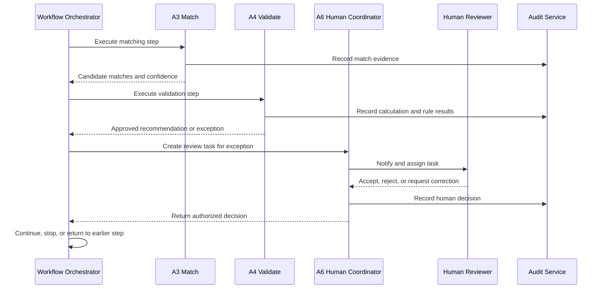

### Why the separation matters

An LLM may misunderstand a sequence, retry a step incorrectly, or route a task inconsistently. The orchestrator provides predictable workflow state. A6 provides flexible human-workflow behavior within the limits of the published configuration.

### Idempotency and safe reruns

Retries and manual reprocessing must not create duplicate results, tasks, notifications, exceptions, or audit events. Each source and workflow run should use:

```text
source_id
file_hash
business_key
workflow_run_id
idempotency_key
reprocessing_policy
```

The platform should detect a previously processed file or business transaction and apply the configured policy: reject as duplicate, resume the existing run, or create a new explicitly linked run.

### Workflow run states

The orchestrator should expose explicit states rather than relying on free-form agent messages:

```text
created -> validating_input -> running -> waiting_for_human
  -> resuming -> completed
  -> failed -> retrying -> failed
  -> cancelled
```

Each state transition records the actor or service, timestamp, reason, configuration version, and related exception. A dependent step is `blocked` until its required input is available or an authorized human resolves the failure.

### Control plane and business capability layers

The architecture has three layers:

```text
Platform control plane:
- Workflow Orchestrator
- Configuration Registry
- Capability Registry
- Policy and Permission Service
- Version and Release Service
- Audit and Lineage Service

Business capability layer:
- A1 Capture
- A2 Harmonize
- A3 Match
- A4 Validate and Recommend
- A5 Explain and Report
- A6 Human Work Coordination

Domain execution services:
- Rule Engine
- Calculation Engine
- Matching Engine
- Master Data Service
- Document Extraction Service
- Exception Service
```

This separation makes ownership clear. Agents perform bounded business tasks. Platform services enforce state, policy, security, versioning, and evidence.

---

## 6. Reusable Workflow Templates

A workflow template is a reusable process blueprint. It defines the possible steps and configuration fields without being tied to one company, file, or use case.

### Example reconciliation template

```text
A1 Capture
A2 Harmonize
A3 Match or compare
A4 Validate
A5 Generate report
A6 Route exceptions and approvals
```

The template becomes a published use case when the admin supplies:

- Data sources
- Field mappings
- Matching strategy
- Calculations
- Rules
- Thresholds
- Routing
- Users
- Report format

```text
Workflow template
+ Admin configuration
+ Finance rules
+ Calculation bindings
+ Field mappings
= Published use case
```

### Recommended template families

| Template | Typical use |
|---|---|
| Reconciliation | Bank-to-GL, AP, AR, intercompany, subledger-to-GL. |
| Matching | Invoice-to-PO, payment-to-invoice, receipt-to-order. |
| Period comparison | Month-over-month, budget-versus-actual, forecast variance. |
| Close management | Close checklist, account certification, evidence collection. |
| Analysis and reporting | Cash flow, balance sheet, profitability, management reporting. |
| Exception processing | Data-quality issues, policy breaches, unmatched records. |
| Approval workflow | Journal review, vendor approval, payment approval, procurement review. |
| Document processing | Invoice, contract, bank advice, expense claim, supporting evidence. |

---

## 7. Rule Engine

The Rule Engine is a reusable Level 3 platform service. It evaluates structured conditions and produces deterministic results.

### Rule responsibilities

- Data-quality validation
- Matching rules
- Accounting control rules
- Materiality rules
- Approval rules
- Exception classification
- Routing rules
- Escalation rules
- Permission checks

### Reusable rule operators

```text
equals
not_equals
greater_than
less_than
greater_than_or_equal
less_than_or_equal
between
is_empty
is_not_empty
contains
in_list
absolute_difference
date_difference
duplicate_check
```

### Example reusable rule

```yaml
rule_id: tolerance_check
version: 1
inputs:
  - actual_difference
  - allowed_tolerance
logic:
  if: absolute(actual_difference) <= allowed_tolerance
  then:
    status: matched
  else:
    status: exception
    severity: medium
```

The same rule can be used for different fields.

```yaml
use_case: bank_to_gl
rule: tolerance_check
mapping:
  actual_difference: bank_gl_difference
  allowed_tolerance: 1.00
```

```yaml
use_case: ap_invoice
rule: tolerance_check
mapping:
  actual_difference: invoice_po_difference
  allowed_tolerance: 5.00
```

### Rule categories

| Category | Example | Typical owner |
|---|---|---|
| Technical | Amount must be numeric. | Developer or platform admin |
| Data quality | Required reference cannot be empty. | Finance admin |
| Matching | Date difference cannot exceed three days. | Finance process owner |
| Accounting control | Difference above materiality requires review. | Finance process owner |
| Approval | Amount above threshold requires controller approval. | Finance control owner |
| Routing | High-severity exception goes to controller queue. | Finance admin |
| Security | User can only access assigned company codes. | Security administrator |

### Rule lifecycle

```text
Draft -> Validate -> Test -> Approve -> Publish -> Deprecate
```

Rules must be versioned. If a tolerance changes from 1.00 to 5.00, the system creates a new rule version. Historical runs continue to reference the old version.

### Chained rules

Rules may consume source fields, calculation outputs, or earlier rule results. A rule chain is different from a calculation chain:

```text
Calculation chain: source values -> derived values
Rule chain: derived values -> decisions and actions
Workflow chain: agent steps -> human tasks -> workflow state
```

Example:

```yaml
rule_pipeline:
  - id: check_final_sum
    depends_on:
      - calculate_final_sum
    condition:
      field: results.final_sum
      operator: greater_than
      value: settings.materiality
    output:
      status: material_exception

  - id: require_controller_review
    depends_on:
      - check_final_sum
      - calculate_final_percentage
    condition:
      field: results.final_percentage
      operator: greater_than
      value: 10
    output:
      action: request_approval
      queue: controller
```

The Rule Engine validates the rule dependency graph, evaluates independent rules in parallel where possible, and blocks dependent rules when required inputs are unavailable. Rule chains must not contain circular dependencies.

---

## 8. Calculation Engine

The Calculation Engine is a reusable Level 3 platform service. It performs approved calculations with typed inputs, deterministic behavior, versioning, and evidence.

### Why calculations are separate from prompts

An LLM can misunderstand arithmetic, rounding, currency, dates, or edge cases. Financial calculations must be reproducible and auditable. Agents call the Calculation Engine instead of performing important calculations inside their prompts.

### Calculation responsibilities

- Validate input types.
- Apply the approved formula or calculator.
- Apply rounding and currency rules.
- Handle missing or zero values explicitly.
- Return structured results.
- Return formula and version information.
- Return input values and source-field references.
- Record execution evidence.

### Reusable calculator examples

```text
add_values
subtract_values
multiply_values
divide_values
calculate_sum
calculate_count
calculate_percentage
calculate_amount_difference
calculate_date_difference
calculate_match_score
calculate_variance
calculate_variance_percentage
calculate_reconciliation_difference
calculate_materiality
calculate_aging_days
calculate_fx_conversion
calculate_cash_flow_total
calculate_working_capital
```

### Same formula, different columns

Suppose the developer creates this reusable calculator:

```text
add_values(value_1, value_2)
```

Use Case 1 maps columns A and B:

```yaml
calculator: add_values
inputs:
  value_1: column_a
  value_2: column_b
output: total
```

Use Case 2 maps columns C and D:

```yaml
calculator: add_values
inputs:
  value_1: column_c
  value_2: column_d
output: total
```

The formula is unchanged. Only the use-case field mapping changes. No developer change is needed.

### New formula capability

If subtraction is not yet available, a developer creates and registers:

```text
subtract_values(value_1, value_2)
```

After registration, the finance admin can use it in any permitted workflow and map different fields:

```yaml
calculator: subtract_values
inputs:
  value_1: invoice_amount
  value_2: discount_amount
output: net_amount
```

### Calculation contract

```json
{
  "calculator_id": "calculate_reconciliation_difference",
  "version": 1,
  "category": "finance_calculation",
  "inputs": {
    "bank_balance": "decimal",
    "gl_balance": "decimal",
    "tolerance": "decimal",
    "currency": "string"
  },
  "outputs": {
    "difference": "decimal",
    "absolute_difference": "decimal",
    "status": "matched | exception"
  },
  "allowed_agents": ["A3", "A4"],
  "read_only": true
}
```

### Calculation result

```json
{
  "difference": 500.00,
  "absolute_difference": 500.00,
  "status": "exception",
  "calculator_id": "calculate_reconciliation_difference",
  "calculator_version": 1,
  "formula_id": "bank_minus_gl",
  "formula_version": 1,
  "currency": "USD",
  "inputs_used": {
    "bank_balance": 125000.00,
    "gl_balance": 124500.00,
    "tolerance": 1.00
  },
  "source_fields": {
    "bank_balance": "bank.closing_balance",
    "gl_balance": "sap_gl.closing_balance"
  }
}
```

### Which agent uses calculations?

| Agent | Calculation use |
|---|---|
| A1 | Usually no finance calculation. May use file-size, row-count, and extraction-quality checks. |
| A2 | Date normalization, currency normalization, duplicate keys, and data-quality metrics. |
| A3 | Amount difference, date difference, quantity difference, candidate ranking, and match score. |
| A4 | Reconciliation difference, variance, materiality, tax checks, aging, and policy calculations. |
| A5 | Should explain trusted results. It should not independently recalculate important accounting numbers. |
| A6 | SLA, due-date, escalation, and task-priority calculations only. |

The workflow defines the allowed tool set. An agent can use only the calculators explicitly bound to its workflow step.

### Calculation and rule ownership

The workflow binds calculations and rules to an agent step, but the engines remain independent services. A3 and A4 may request execution; neither agent may alter the implementation or bypass validation.

```text
Agent request
  -> Orchestrator checks workflow binding
  -> Policy service checks user and data scope
  -> Calculation or Rule Engine executes
  -> Structured result returns
  -> Audit Service records inputs, version, result, and evidence
```

### Calculation semantics

Every workflow must define common calculation behavior. Individual calculators must not silently choose different conventions.

```yaml
calculation_policy:
  null_behavior: create_exception
  blank_string_behavior: create_exception
  zero_denominator: create_exception
  rounding_mode: half_even
  decimal_places: 2
  currency_mismatch: stop_pipeline
  date_timezone: workflow_timezone
  negative_amount_policy: preserve_sign
```

The platform must explicitly handle nulls, blanks, negative numbers, zero denominators, decimal precision, rounding, currencies, debit and credit signs, dates, time zones, and invalid numeric values.

### Chained calculations and calculation pipelines

Some use cases need several calculations where later calculations consume the outputs of earlier calculations. This is supported through a versioned calculation pipeline.

Each calculation is a node with:

- A unique step ID.
- A registered calculator and version.
- Input mappings.
- An output mapping.
- Optional dependencies on earlier calculation steps.
- A scope: `row`, `group`, or `aggregate`.
- Optional grouping fields.
- Missing-value, zero-denominator, rounding, and currency behavior.

The input of a calculation may come from either an original source field or a previous calculation result:

```text
Original input:       dataset.amount
Previous result:      results.sum_1
```

The Workflow Orchestrator builds a dependency graph and runs independent nodes in parallel. A dependent node waits until all of its dependencies have completed.

#### Example: multiple calculations with derived results

```yaml
calculation_pipeline:
  - id: calculate_sum_1
    calculator: calculate_sum
    version: 1
    used_by: A4
    scope: aggregate
    input_mapping:
      values: dataset.amount_group_a
    output_mapping:
      result: results.sum_1

  - id: calculate_sum_2
    calculator: calculate_sum
    version: 1
    used_by: A4
    scope: aggregate
    input_mapping:
      values: dataset.amount_group_b
    output_mapping:
      result: results.sum_2

  - id: calculate_aging_days
    calculator: calculate_aging_days
    version: 1
    used_by: A4
    scope: row
    input_mapping:
      transaction_date: dataset.transaction_date
      current_date: settings.reporting_date
    output_mapping:
      result: results.aging_days

  - id: calculate_initial_percentage
    calculator: calculate_percentage
    version: 1
    used_by: A4
    scope: aggregate
    input_mapping:
      numerator: results.sum_1
      denominator: dataset.total_amount
    output_mapping:
      result: results.initial_percentage
    depends_on:
      - calculate_sum_1

  - id: calculate_final_sum
    calculator: add_values
    version: 1
    used_by: A4
    scope: aggregate
    input_mapping:
      value_1: results.sum_1
      value_2: results.sum_2
    output_mapping:
      result: results.final_sum
    depends_on:
      - calculate_sum_1
      - calculate_sum_2

  - id: calculate_final_percentage
    calculator: calculate_percentage
    version: 1
    used_by: A4
    scope: aggregate
    input_mapping:
      numerator: results.final_sum
      denominator: dataset.total_amount
    output_mapping:
      result: results.final_percentage
    depends_on:
      - calculate_final_sum
```

The execution order is:

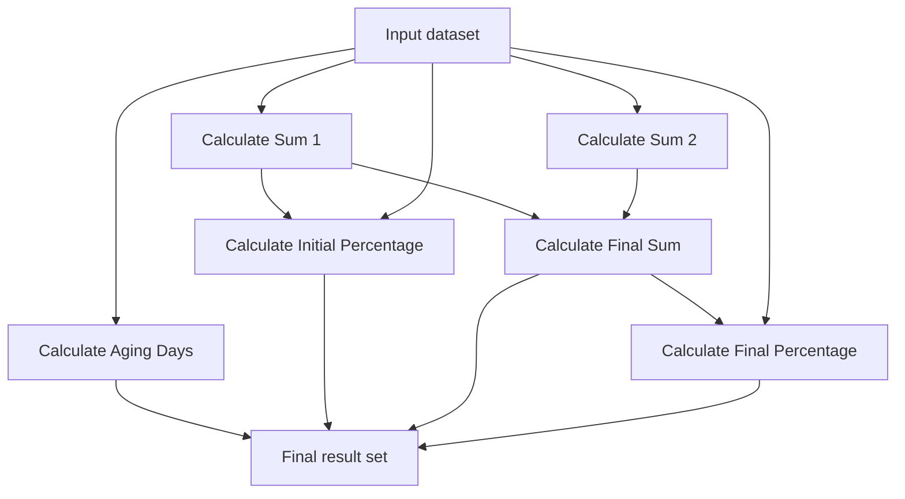

`calculate_sum_1`, `calculate_sum_2`, and `calculate_aging_days` can run independently. `calculate_initial_percentage` waits for Sum 1. `calculate_final_sum` waits for Sum 1 and Sum 2. `calculate_final_percentage` waits for the final sum.

#### Row, group, and aggregate scope

The admin must choose the calculation scope:

| Scope | Meaning | Example |
|---|---|---|
| `row` | Calculate once for each record. | Aging days for every invoice. |
| `group` | Calculate once per configured group. | Total amount by company code and fiscal period. |
| `aggregate` | Calculate once for the complete selected dataset. | Total bank balance for a reconciliation run. |

Group calculations require explicit grouping fields:

```yaml
scope: group
group_by:
  - company_code
  - fiscal_period
```

The platform must reject an invalid scope connection. For example, a row-level result cannot silently be used as one aggregate input without an explicit aggregation step.

#### Admin pipeline builder

The admin should configure the pipeline visually or through a guided form:

```text
Step 1: Sum 1
Calculator: Calculate Sum
Input: Column A
Output: sum_1

Step 2: Sum 2
Calculator: Calculate Sum
Input: Column B
Output: sum_2

Step 3: Final Sum
Calculator: Add Values
Input 1: sum_1
Input 2: sum_2
Output: final_sum

Step 4: Final Percentage
Calculator: Calculate Percentage
Numerator: final_sum
Denominator: Total Amount
Output: final_percentage
```

The admin connects an earlier output to a later input. The platform automatically creates `depends_on` entries and displays the dependency graph before publishing.

#### Pipeline validation

Before saving or publishing, the Configuration API must verify:

- Every calculation step has a unique ID.
- Every calculator exists and its version is published.
- Every required input is mapped.
- Every referenced previous output exists.
- Dependencies do not create a circular loop.
- Input and output data types are compatible.
- Row, group, and aggregate scopes are compatible.
- Grouping fields are defined when `scope: group` is used.
- Division and percentage calculations define zero-denominator behavior.
- Missing values have an explicit policy.
- Currency and rounding behavior are defined.
- The selected agent is allowed to use each calculator.

Invalid configuration:

```text
Sum 1 depends on Final Sum
Final Sum depends on Sum 1
```

This is a circular dependency and must be rejected. The pipeline must be a directed acyclic graph.

#### Calculation failures

A failed calculation must produce a controlled error and an audit event. It must not be replaced with a guessed value.

```yaml
error_policy:
  missing_input: create_exception
  zero_denominator: create_exception
  invalid_currency: stop_pipeline
  calculator_unavailable: retry_then_route_to_A6
```

The orchestrator can continue independent branches when the policy allows it, but a dependent calculation must wait or be marked blocked. A6 routes blocked or failed work for human review.

### Rules consuming calculation outputs

Rules can consume the outputs of a calculation pipeline or earlier rules. The workflow must declare these dependencies explicitly. A calculation result is data; a rule result is a decision or action.

```text
calculate_sum_1
calculate_sum_2
  |
  v
calculate_final_sum
  |
  v
check_materiality
  |
  v
require_controller_review
```

The Configuration API must reject missing references, incompatible scopes, circular dependencies, and rules that use unapproved outputs. A5 explains the resulting decisions and A6 routes any required human action.

#### Calculation lineage

Every derived result records its full dependency chain:

```json
{
  "calculation_id": "calculate_final_percentage",
  "calculator": "calculate_percentage",
  "calculator_version": 1,
  "depends_on": ["calculate_final_sum"],
  "inputs": {
    "numerator": {
      "source": "results.final_sum",
      "value": 2000
    },
    "denominator": {
      "source": "dataset.total_amount",
      "value": 10000
    }
  },
  "result": {
    "output": "results.final_percentage",
    "value": 20
  }
}
```

This allows a reviewer to trace:

```text
Source columns
  -> Sum 1 and Sum 2
  -> Final Sum
  -> Final Percentage
```

The LLM may suggest a pipeline, but it must not change the execution order at runtime. The approved configuration defines the graph, and the deterministic orchestrator executes it.

---

## 9. Rule and Calculation Binding

A workflow connects agents, rules, and calculations explicitly.

```yaml
workflow:
  id: bank_to_gl_reconciliation
  version: 1

steps:
  - id: capture
    agent: A1

  - id: harmonize
    agent: A2

  - id: match
    agent: A3
    calculations:
      - id: calculate_amount_difference
        version: 1
      - id: calculate_date_difference
        version: 1
      - id: calculate_match_score
        version: 1
    rules:
      - id: candidate_match_rule
        version: 1

  - id: validate
    agent: A4
    calculations:
      - id: calculate_reconciliation_difference
        version: 1
        input_mapping:
          bank_balance: bank.closing_balance
          gl_balance: sap_gl.closing_balance
          tolerance: settings.amount_tolerance
          currency: bank.currency
    rules:
      - id: bank_difference_tolerance
        version: 1
      - id: materiality_check
        version: 1
      - id: human_review_rule
        version: 1

  - id: report
    agent: A5

  - id: route
    agent: A6
```

The execution model is:

```text
Workflow selects agent
Workflow selects permitted tools
Workflow maps input fields
Workflow selects rules
Agent executes within those limits
Audit service records the result
```

---

## 10. Admin Experience

The admin is a finance-aware process owner who may also have prompt and configuration skills. The admin should not need to write application code for normal use-case changes.

### Admin navigation

```text
Dashboard
Use Cases
Agent Templates
  A1 Capture
  A2 Harmonize
  A3 Match
  A4 Validate
  A5 Explain
  A6 Route and Coordinate
Calculation Engine
Rule Engine
Capability Registry
Super Admin Extensions
Data Sources
Master Data
Test Runs
Approvals
Published Versions
Audit Logs
System Settings
```

### Admin home page

The dashboard should show:

- Draft use cases
- Configurations waiting for approval
- Failed tests
- Published workflows
- Recent runs
- Open exceptions
- Formula and rule changes
- Configuration versions
- Data-source health

### Use Case Builder

The main admin flow should be:

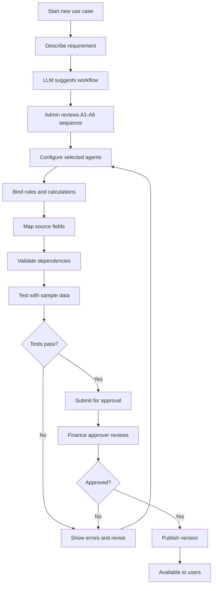

### Natural-language use-case creation

Example admin request:

> Create a bank-to-GL reconciliation workflow using an SAP GL export and an Excel bank statement. Match by amount, reference, and transaction date. Allow a three-day date difference and a one-dollar amount difference. Send unmatched items to Finance Operations.

The LLM proposes:

```text
A1 -> A2 -> A3 -> A4 -> A5 -> A6
```

It also proposes mappings, rules, calculations, and routing. These are drafts. The admin reviews the generated structured configuration before continuing.

### Agent configuration page

Each agent has a hardcoded configuration template. The platform renders the fields relevant to that agent.

#### Common fields

- Agent name
- Purpose
- System prompt
- Input schema
- Output schema
- Required settings
- Optional settings
- Default LLM
- Confidence threshold
- Error handling
- Allowed tools
- Permission scope
- Test cases

#### A1 page

```text
Agent: A1 Capture

Prompt:                 [Capture bank transaction data ...]
Input source types:     [Excel] [CSV] [PDF] [SAP export]
Required fields:        [transaction_date, amount, currency, reference]
Extraction confidence:  [95%]
Invalid file action:    [Quarantine]
Default LLM:            [Approved model]
```

#### A3 page

```text
Agent: A3 Match and Reconcile

Dataset 1:              [Bank transactions]
Dataset 2:              [SAP GL transactions]
Match fields:           [amount, date, reference]
Amount tolerance:       [1.00 USD]
Date tolerance:         [3 days]
Match calculator:       [calculate_match_score v1]
Rules:                  [candidate_match_rule v1]
Low confidence action:  [Send to reviewer]
```

#### A6 page

```text
Agent: A6 Route and Coordinate

Exception queue:        [Finance Operations]
High-value queue:       [Controller]
Escalation after:       [2 business days]
Reviewer decisions:     [Accept, Reject, Correct, Request information]
Reject behavior:        [Return to A3]
Notification:            [Email and in-app]
```

### Rule Builder

The admin can select reusable operators and configure conditions.

```text
When:
[Absolute Difference] [less than or equal to] [Amount Tolerance]

Then:
[Set status] to [Matched]

Otherwise:
[Create exception]
Severity: [Medium]
Assign to: [Finance Operations]
```

The admin may describe the rule in natural language. The LLM converts it to a draft structured rule. The admin must test and approve it.

### Calculation Binding page

The admin selects an approved calculator and maps its inputs.

```text
Calculator: [add_values v1]

value_1: [Bank Fees]
value_2: [Bank Charges]
result:   [Total Charges]

Rounding: [2 decimals]
Currency: [Source currency]
```

The admin changes field mappings without changing the calculator implementation.

### Admin configuration control guide

The UI should use the simplest safe control for each type of configuration. A free-text box should not be used when a controlled option, schema, or mapping is available.

| Configuration need | Recommended UI control | Why it is appropriate | Example |
|---|---|---|---|
| Choose a workflow template | Searchable dropdown or template cards | Prevents invalid workflow types and helps the admin start from a known process. | `Reconciliation`, `Period comparison`, `Close management`. |
| Select participating agents | Multi-select list with agent descriptions | Allows workflows to use only the required agents. | Select A1, A2, A3, A4, A5, and A6. |
| Arrange workflow steps | Visual stepper or drag-and-drop flow builder | Makes sequence and conditional branches visible. | A4 -> exception review -> A6 -> A5. |
| Choose a source system | Dropdown or source cards | Limits selection to registered and authorized sources. | SAP export, Excel, CSV, PDF. |
| Choose a file format or sheet | Dropdown, file picker, and sheet selector | Prevents unsupported files and makes input selection explicit. | Excel workbook -> `Bank_Statement` sheet. |
| Map source fields | Field-mapping table with dropdowns | Provides source-field-to-canonical-field validation and lineage. | `Amt in Local Currency` -> `amount`. |
| Define a required field | Checkbox or required-field toggle | Makes schema requirements visible and testable. | `reference` required for bank matching. |
| Select a calculator | Searchable dropdown showing version and description | Restricts use to published calculators. | `subtract_values v1`. |
| Map calculator inputs | Input-mapping dropdowns with type indicators | Prevents missing or incompatible inputs. | `value_1` -> `invoice.total_amount`. |
| Build a calculation chain | Visual node editor plus dependency list | Shows parallel steps, derived outputs, and dependencies. | Sum 1 + Sum 2 -> Final Sum -> Percentage. |
| Enter an amount or tolerance | Numeric input with currency selector | Prevents non-numeric values and makes currency explicit. | `1.00 USD`. |
| Enter a percentage | Numeric input with min/max validation | Prevents invalid percentage values. | `10%` materiality threshold. |
| Select an operator | Dropdown | Prevents unsupported or unsafe expressions. | `less than or equal to`. |
| Configure a rule condition | Rule-builder row: field, operator, value | Produces structured and auditable rules. | `absolute_difference <= tolerance`. |
| Configure rule action | Action dropdown plus parameter fields | Restricts outcomes to approved actions. | Set status, create exception, request approval. |
| Configure prompt instructions | Multiline prompt editor with guidance and preview | Natural language is useful for interpretation and explanation. | A1 extraction instruction. |
| Select an LLM | Approved-model dropdown | Prevents unapproved models and makes model selection auditable. | Approved on-premises model. |
| Set confidence threshold | Percentage input or slider with numeric value | Makes the review boundary explicit. | `95%` extraction confidence. |
| Set exception severity | Dropdown | Keeps severity values consistent. | Low, medium, high, critical. |
| Select a review queue | Searchable dropdown | Routes work only to registered queues. | Finance Operations. |
| Configure reviewers | Role/user multi-select | Supports permissions and segregation of duties. | Finance Reviewer, Controller. |
| Configure escalation time | Numeric stepper plus business-day selector | Avoids ambiguous SLA values. | Escalate after 2 business days. |
| Configure notification text | Template editor with approved variables | Allows communication changes without changing workflow logic. | `{{exception_id}}` and `{{due_date}}`. |
| Configure privacy or masking | Field multi-select and policy dropdown | Prevents accidental exposure of sensitive fields. | Mask bank account number. |

### Controls that should not be free text

These values must use structured controls and validation:

- Calculator ID and version
- Rule operator and action
- Source field mapping
- Canonical field name
- Numeric amount, percentage, and tolerance
- Currency
- Date and fiscal period
- Agent selection
- Workflow order and dependencies
- Queue, role, and approval identity
- Tool permission
- Audit policy

Free text is appropriate for bounded prompts, descriptions, notification templates, and report commentary. Even then, the system must validate length, allowed variables, prohibited instructions, and security boundaries.

### Recommended Admin page layout

```text
+------------------------------------------------------------------+
| Use Case: Bank-to-GL Reconciliation        Status: Draft  L3     |
+----------------------+-------------------------------------------+
| Setup navigation     | Main configuration panel                  |
|                      |                                           |
| 1. Requirement       | Selected section fields                  |
| 2. Sources           | Dropdowns, mappings, forms, or builder   |
| 3. Agents            |                                           |
| 4. Rules             | Right-side validation and help panel      |
| 5. Calculations      | - Missing required fields                 |
| 6. Routing           | - Invalid mappings                        |
| 7. Test              | - Affected workflows                      |
| 8. Review and publish| - Required approver                       |
+----------------------+-------------------------------------------+
| Save draft | Validate | Test run | Submit for approval              |
+------------------------------------------------------------------+
```

### Recommended admin setup flow

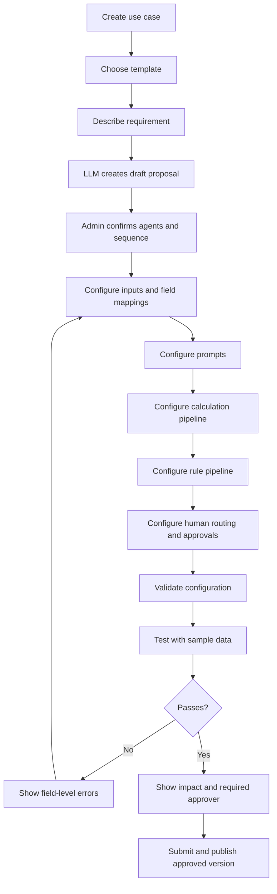

### Conditional runtime flow

The admin setup flow and the production runtime are different. Setup is a form sequence; runtime is a conditional workflow graph.

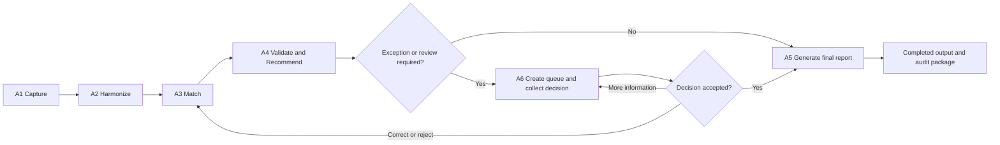

The workflow configuration must define which branch applies. A5 may produce a draft report before review, but the final report must include the human decision and updated evidence.

### Test Runner

The test runner should show:

- Input files and source records
- Extracted values
- Canonical mapped fields
- Agent-by-agent outputs
- Tool calls
- Calculation inputs and outputs
- Rule results
- Exceptions created
- Expected versus actual results
- Warnings and missing fields
- Audit events
- Change impact level and affected workflows
- Required approver and release checks

### Configuration change workflow

The Admin UI should display change impact before allowing publication:

```text
Draft change
  -> Detect changed fields
  -> Calculate L1-L5 impact
  -> Show affected workflows and data scopes
  -> Select required tests and approvers
  -> Run test data
  -> Submit for approval
  -> Publish a new immutable version
```

---

## 11. Configuration Levels

Configuration levels describe the type of work required to change a workflow. They are separate from user roles: a Finance Admin may make L1-L2 changes, a Finance Process Owner may approve L3 changes, and a Super Admin or Developer owns L4-L5 platform changes.

```text
L1: Change wording or presentation
L2: Change data shape or field mapping
L3: Change finance rules, parameters, or calculation composition
L4: Change workflow or agent-template behavior
L5: Add new backend capability or platform code
```

### Level 1: Prompt and presentation configuration

L1 changes affect how an existing capability is described or displayed. They do not change the data meaning, financial calculation, rule logic, permissions, or workflow path.

#### Typical L1 changes

- Change an agent label or description.
- Improve a bounded prompt instruction.
- Change report title or explanatory wording.
- Change notification text using approved variables.
- Change the display order of report sections.

#### Example

```text
Before: Explain reconciliation exceptions.
After:  Explain reconciliation exceptions in short, controller-ready language.
```

#### UI controls and controls

Use a multiline prompt editor, label text box, report-template selector, or notification-template editor. The platform validates length, approved variables, prohibited instructions, and prompt boundaries.

L1 usually requires basic validation and a prompt or output regression test. It must still create a new version when it affects a published workflow.

### Level 2: Data schema and mapping configuration

L2 changes affect which data enters an agent or how source fields map to canonical fields. No new calculation or rule logic is created, but incorrect mapping can change the financial meaning of a result.

#### Typical L2 changes

- Map Excel Column A to `amount`.
- Change the bank statement sheet.
- Add a required source field.
- Map `Posting Dt` to `posting_date`.
- Select a different SAP export layout already supported.
- Map vendor or account codes to existing master data.

#### Example

```text
Use Case 1:
  value_1 -> Column A
  value_2 -> Column B

Change:
  value_1 -> Column C
  value_2 -> Column D
```

The `add_values` calculator did not change. Only its input mapping changed.

#### UI controls and controls

Use a source selector, file picker, sheet dropdown, source-to-canonical field-mapping table, required-field checkbox, and type indicators. The UI should show sample values and a preview of the mapped output.

L2 requires schema validation, sample-file testing, type compatibility checks, mapping-confidence review, and lineage verification. A mapping that changes financial meaning may be escalated to L3 approval.

### Level 3: Rule and calculation configuration

L3 changes alter financial behavior using capabilities that already exist. They do not add backend code, but they can change results and therefore require finance review.

#### Typical L3 changes

- Select an existing calculator.
- Map calculator inputs to different fields.
- Connect one calculation output to another calculation input.
- Change tolerance or materiality.
- Add or remove an existing rule.
- Change rule conditions or actions.
- Configure rounding, currency, null, or zero-denominator behavior.
- Change a calculation pipeline or rule pipeline while keeping existing capabilities.

#### Example: same calculator, different use cases

```yaml
use_case: bank_to_gl
calculator: subtract_values
input_mapping:
  value_1: bank.closing_balance
  value_2: sap_gl.closing_balance
output: bank_gl_difference
```

```yaml
use_case: ap_invoice
calculator: subtract_values
input_mapping:
  value_1: invoice.total_amount
  value_2: purchase_order.total_amount
output: invoice_po_variance
```

#### Example: chained calculation change

```text
Sum 1 + Sum 2 -> Final Sum -> Final Percentage
```

Adding `calculate_final_percentage` using already-published calculators is L3. Creating a new percentage algorithm that the engine does not support is L5.

#### UI controls and controls

Use a calculator dropdown with version, input-mapping dropdowns, numeric inputs, currency selectors, a visual calculation pipeline, a rule-builder row, and dependency validation. Do not permit arbitrary code or unrestricted expressions.

L3 requires boundary tests, expected-result review, finance-owner approval, a new configuration version, and impact analysis for all affected workflows.

### Level 4: Workflow and agent-template configuration

L4 changes the behavior or structure of the workflow itself. These changes can alter execution order, human controls, output contracts, or how an agent is configured.

#### Typical L4 changes

- Add or remove an agent from a workflow.
- Reorder A5 and A6.
- Add a human-review gate.
- Add a conditional branch or return path.
- Change A6 approval routing behavior.
- Change an agent input/output contract.
- Modify the hardcoded configuration template shown for an agent.
- Add a new workflow template using existing capabilities.

#### Example

```text
Before: A4 -> A5 final report
After:  A4 -> A6 human review -> A5 final report
```

This is L4 because it changes workflow control, even though no new calculator or rule is created.

#### UI controls and controls

Use a visual workflow builder, stepper, conditional-branch editor, agent multi-select, queue selector, approval-matrix editor, and schema preview. The system must prevent cycles, unreachable steps, missing failure paths, and unauthorized approval routes.

L4 requires end-to-end regression tests, permission and segregation-of-duties tests, failure and recovery tests, Super Admin review, and finance-owner approval.

### Level 5: New capability or platform-code configuration

L5 introduces something the existing platform cannot perform. It requires backend or infrastructure work by a Super Admin or Developer.

#### Typical L5 changes

- Create A7 Forecast and Scenario Analysis.
- Add `divide_values` when division is not supported.
- Add a new tax or depreciation calculator.
- Add a new rule operator.
- Add a new PDF parser or SAP connector.
- Add an MCP tool or A2A agent service.
- Add SAP write-back.
- Add new security, storage, or orchestration behavior.

#### Example

```text
Existing capability: add_values(value_1, value_2)
New requirement:     calculate present value using discount rate and periods
Result:              developer creates and publishes a new calculator
```

The Super Admin defines the capability contract, schemas, permissions, side effects, tests, compatibility, monitoring, and publication policy. Finance Admins can configure the capability only after it is published.

L5 requires unit, security, compatibility, performance, evaluation, integration, and controlled release testing.

### Configuration levels and ownership summary

| Level | What changes | Typical UI | Primary owner | Required review |
|---|---|---|---|---|
| L1 | Prompt, label, report wording | Text box, prompt editor, template selector | Finance Admin | Basic validation and regression test |
| L2 | Input schema, source field, mapping | Dropdowns, field-mapping table, file/sheet selector | Finance Admin or Super Admin for schema | Schema, sample-data, type, and lineage tests |
| L3 | Existing rules, calculators, parameters, chains | Rule builder, numeric inputs, calculator binding, pipeline builder | Finance Process Owner | Boundary tests and finance approval |
| L4 | Workflow sequence, branches, agent templates, approval gates | Visual workflow builder and schema editor | Super Admin with Finance Owner | End-to-end, security, recovery, and release review |
| L5 | New agents, calculators, operators, connectors, platform code | Super Admin Extensions, Capability Registry, developer API | Super Admin / Developer | Unit, security, compatibility, performance, and controlled publication |

### How to classify a real change

Always choose the highest level involved:

```text
Change only the wording of A1 prompt                       -> L1
Change A1 input from Column A to Column C                  -> L2
Change bank tolerance from 1 USD to 5 USD                  -> L3
Add a calculation output to a later calculation            -> L3
Insert human review between A4 and A5                     -> L4
Create a new divide or tax calculator                      -> L5
Create A7 Forecast and Scenario Analysis                   -> L5
```

The platform should calculate the level from the changed object and fields. The admin may request stricter review, but cannot lower the calculated level.

The goal is that normal variations in finance processes are handled at L1-L3 without development. L4-L5 changes extend the reusable platform.

### Configuration change impact levels

The ownership levels above answer **who may make a change**. The following impact levels answer **how difficult and risky the change is**. Every draft configuration change should receive one impact level automatically and show it to the admin.

| Impact level | Meaning | Detailed example | UI or template affected | Owner | Approval and testing |
|---|---|---|---|---|---|
| L1 | Changes presentation or bounded language only; financial meaning and workflow behavior stay the same. | Change A1 from “Extract invoice data” to “Extract invoice data and show confidence.” Change a report title or notification wording. | Label text box, prompt editor, report or notification template. | Finance Admin within approved prompt boundaries. | Validate allowed text and variables; run prompt/output regression test. |
| L2 | Changes the shape or source of data; existing business logic remains the same. | Change `add_values` from `Column A + Column B` to `Column C + Column D`. Map `Posting Dt` to `posting_date`, or select another approved Excel sheet. | File picker, sheet dropdown, source-to-canonical field-mapping table, schema form. | Finance Admin; shared-schema changes may require Super Admin. | Validate schema and types; test with sample files; verify mapping and lineage. |
| L3 | Changes financial behavior by configuring existing rules, calculators, parameters, or chains. | Change tolerance from `1 USD` to `5 USD`; add `sum_1 + sum_2 -> final_sum`; add a materiality rule based on `final_percentage`. | Rule Builder, Calculation Pipeline Builder, numeric inputs, A3/A4 forms. | Finance Admin or Finance Process Owner. | Test boundaries, nulls, currencies, zero denominators, expected results, and finance approval. |
| L4 | Changes the workflow structure, agent template, human control, or contract. | Insert A6 review between A4 and A5; route high-value exceptions to the Controller; add a new branch or required agent output. | Visual Workflow Builder, Agent Template editor, A6/orchestrator configuration. | Super Admin with Finance Process Owner review. | Run end-to-end, permission, segregation-of-duties, failure, recovery, and release tests. |
| L5 | Adds capability or platform code that did not previously exist. | Create `divide_values`, add a tax calculator, implement A7, add a PDF parser, expose an MCP tool, connect an A2A service, or enable SAP write-back. | Super Admin Extensions, Capability Registry, backend service, API, or integration adapter. | Super Admin / Developer. | Run unit, security, compatibility, performance, evaluation, integration, and controlled-publication tests. |

#### How to identify the level

Use the highest-impact level when a change crosses more than one category. A change is classified by what it does, not by how small the screen edit appears:

```text
Change prompt wording only              -> L1
Change which source field is used       -> L2
Change tolerance or formula binding     -> L3
Change step order or review routing     -> L4
Create subtraction when unavailable     -> L5
```

Examples:

```text
Use Case 1: add_values(Column A, Column B) -> total
Change Column A to Column C                -> L2

Use Case 2: change tolerance from 1 to 5   -> L3

Use Case 3: insert A6 review before A5     -> L4

Use Case 4: developer creates divide_values -> L5

Example impact report:

```text
Change request: Use bank fees plus bank charges to calculate total charges.
Detected level: L3
Reason: Existing add_values calculator is being bound to different inputs.
Affected objects: A4 calculation pipeline, report output, audit lineage.
Required tests: positive values, blanks, negative values, currency, rounding.
Required approver: Finance Process Owner.
New version: bank_fee_analysis v2.
```
```

An L1 or L2 change may still become L3 or higher if it changes financial meaning. For example, renaming a display label is L1, but changing the canonical meaning of `amount` is at least L2 and may require L3 finance review.

#### Change-level mapping to platform areas

| Platform area | L1 | L2 | L3 | L4 | L5 |
|---|---|---|---|---|---|
| A1 Capture | Prompt and labels | File fields and source mapping | Extraction-quality rules | New capture step or source behavior | New parser or connector |
| A2 Harmonize | Mapping instructions | Canonical schema and mappings | Normalization and data-quality rules | New harmonization stage | New transformation capability |
| A3 Match | Matching instructions | Match-field mapping | Tolerances, scores, and match rules | New matching branch or review gate | New matching algorithm |
| A4 Validate | Validation wording | Validation input/output fields | Rules, formulas, and thresholds | New approval or decision stage | New finance calculator or rule operator |
| A5 Explain | Report wording and labels | Report fields | Report validation and calculation bindings | New report workflow | New report engine or integration |
| A6 Coordinate | Notification wording | Queue fields and user mapping | Routing conditions and SLA values | Workflow dependencies and approval gates | New coordination capability |
| Rule Engine | Rule description | Rule input mapping | Conditions and actions | Rule-chain structure | New operator or rule implementation |
| Calculation Engine | Calculator description | Input/output mapping | Parameters and pipeline dependencies | New calculation stage | New calculator implementation |

#### Required behavior in the Admin UI

When an admin changes a configuration, the UI should show:

```text
Change level: L3
Affected object: bank_difference_tolerance
Affected workflows: 4
Affected agents: A4, A6
Required tests: tolerance boundary, materiality, reviewer routing
Required approver: Finance Process Owner
New version: bank_difference_tolerance v2
```

The system should calculate impact from the changed fields, not rely only on the admin selecting a level manually. An admin may request a higher review level, but cannot downgrade a calculated level.

---

## 12. Versioning and Publishing

Every production result must be reproducible.

### Versioned objects

- Agent definition
- Agent prompt
- Workflow definition
- Field mapping
- Rule
- Calculation
- Tool implementation
- Model selection
- Audit policy
- Approval matrix
- Master-data mapping

Change impact level and affected-object analysis must also be stored with every draft, test run, approval, publication, and production execution.

### Publishing lifecycle

```text
Draft
  -> Validate
  -> Test
  -> Submit for approval
  -> Approved
  -> Published
  -> Monitored
  -> Deprecated
```

A published run records:

```text
workflow_version
agent_versions
prompt_version
rule_versions
calculation_versions
tool_versions
model_version
configuration_version
input_snapshot
user_decisions
```

A later configuration change must create a new version. It must not rewrite historical results.

The publish process must include the calculated change impact level. L1 and L2 changes may use a lighter approval path when policy permits; L3 changes require finance review; L4 and L5 changes require Super Admin, security, and end-to-end release review as applicable.

### Configuration impact analysis

Before publishing a rule, calculation, prompt, mapping, or capability change, the Configuration Registry should show:

- Which workflows use the object.
- Which agent versions depend on it.
- Which company codes, entities, and reports may be affected.
- Whether the change affects future runs, historical replay, or both.
- Required approvers and test results.

Master-data mappings must also be versioned, with ownership, effective dates, approval history, and a clear source of truth such as SAP or an approved local override.

---

## 13. Human Review and Exceptions

Human review is a core feature, not a fallback.

### Exception examples

- Low-confidence extraction
- Missing required field
- Unmapped account
- Unmatched transaction
- Duplicate record
- Tolerance breach
- Material variance
- Conflicting source values
- Missing supporting evidence
- Rule violation
- Unauthorized action
- Calculation input error

### Exception record

```json
{
  "exception_id": "exc-10045",
  "run_id": "run-2026-0001",
  "type": "reconciliation_difference",
  "severity": "medium",
  "status": "open",
  "owner_queue": "finance_operations",
  "reason": "Difference exceeds configured tolerance",
  "evidence": ["bank_row_145", "sap_balance_2026_08"],
  "proposed_action": "Review bank fee or timing difference",
  "required_decision": "accept | reject | correct | request_information",
  "configuration_version": 1
}
```

The review screen should show the source records side by side with:

- Proposed match or decision
- Calculation details
- Rule results
- Confidence
- Source evidence
- Comments
- Previous decisions
- Override reason
- Approve, reject, correct, and request-information actions

### Approval and segregation of duties

The review configuration must define who may decide and whether more than one approval is required. The system should prevent a user from approving their own configuration, override, or submitted transaction when segregation-of-duties rules prohibit it.

The approval model should support:

- Role and entity-based authorization
- Amount-based approval levels
- Two-person approval
- Delegation and absence handling
- Required comments and evidence
- Conflict-of-interest checks
- Decision deadlines
- Reopening and escalation rules
- Full decision history

---

## 14. Audit and Lineage

Audit is a shared mandatory platform service. Its details may be configurable, but the core audit trail cannot be disabled for finance workflows.

### Mandatory audit events

- User login and identity
- Source file received
- Original source snapshot
- Extraction result
- Field mapping
- Normalization
- Agent start and completion
- Prompt and agent version
- Tool invocation
- Calculation inputs and outputs
- Rule inputs and results
- Exception creation
- Human decision
- Manual override and reason
- Approval or rejection
- Workflow state change
- Retry and error
- Published configuration

### Audit event example

```json
{
  "event_id": "evt-10045",
  "run_id": "run-2026-0001",
  "event_type": "rule_evaluated",
  "agent": "A4",
  "rule_id": "bank_difference_tolerance",
  "rule_version": 1,
  "inputs": {
    "difference": 500.00,
    "tolerance": 1.00
  },
  "result": {
    "status": "exception",
    "severity": "medium"
  },
  "source_records": ["bank_row_145", "sap_balance_2026_08"],
  "timestamp": "2026-08-26T10:30:00Z"
}
```

### Configurable audit policy

```yaml
audit_policy:
  id: finance_standard_audit
  version: 1
  capture_source_snapshots: true
  capture_prompt_version: true
  capture_tool_inputs: true
  capture_tool_outputs: true
  require_override_reason: true
  mask_fields:
    - bank_account_number
  retention_days: 2555
```

### Audit integrity

Audit records should be append-only and protected from ordinary administrative edits. The service should support immutable event IDs, restricted deletion, retention locks, export for auditors, and logging of audit-log access. Where required, events may also include a hash chain or digital signature.

---

## 15. Security and Governance

The platform handles sensitive financial information and must use least privilege.

### Security requirements

- Role-based access control
- Entity and company-code isolation
- Source-level permissions
- Tool-level permissions
- Read-only SAP access initially
- Separate approval permissions
- No unrestricted code execution from admin prompts
- Secret management outside configuration files
- Encryption in transit and at rest
- Data-retention controls
- Document prompt-injection defenses
- Input-file malware scanning
- Sensitive-field masking
- Full audit logging
- On-premises deployment support

### Untrusted documents and external capabilities

Documents are data, never instructions. Text inside a PDF, spreadsheet cell, email, MCP response, or A2A response must not change system prompts, permissions, workflow configuration, or approval rules.

External capabilities must be explicitly trusted and allowlisted. Discovery must never automatically grant execution access.

### Tool permissions

```yaml
agent_permissions:
  A1:
    allowed_tools:
      - read_sap_export
      - parse_excel
      - parse_csv
      - extract_pdf_table
      - validate_required_fields

  A2:
    allowed_tools:
      - normalize_date
      - normalize_currency
      - map_account
      - detect_duplicate

  A3:
    allowed_tools:
      - find_candidate_matches
      - calculate_amount_difference
      - calculate_date_difference
      - calculate_match_score

  A4:
    allowed_tools:
      - calculate_reconciliation_difference
      - calculate_variance
      - calculate_materiality
      - evaluate_business_rule
      - create_exception

  A5:
    allowed_tools:
      - retrieve_evidence
      - generate_report
      - create_chart

  A6:
    allowed_tools:
      - assign_task
      - notify_user
      - escalate_task
      - request_approval
```

The workflow selects the permitted tools. The agent can choose only from that restricted set.

---

## 15A. Non-Functional Requirements

The implementation must define measurable targets before production sizing. At minimum, specify:

```text
Maximum source-file size
Maximum row count per run
Expected processing time
Concurrent workflow runs
Queue throughput
Availability target
Recovery time objective
Recovery point objective
Model and tool timeout
Audit retention period
Maximum cost per run
```

These targets determine storage, worker capacity, parser limits, model deployment, retry behavior, and monitoring requirements.

MCP and A2A services additionally require service identity verification, endpoint allowlists, authentication, TLS, request timeouts, rate limits, schema compatibility checks, version pinning, network policy, and defined failure behavior. All remote calls pass through the same permission, exception, and audit services as internal tools.

---

## 16. End-to-End Runtime Flow

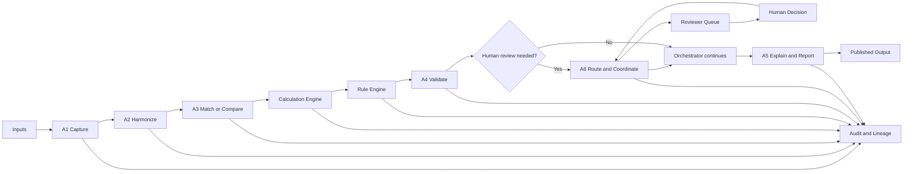

### Bank-to-GL example

```text
1. A1 receives SAP GL and bank files.
2. A2 maps and normalizes source fields.
3. A3 finds candidate transaction matches.
4. A3 calls amount, date, and match-score calculators.
5. The Rule Engine evaluates match rules.
6. A4 calculates the final reconciliation difference.
7. A4 applies tolerance and materiality rules.
8. A6 sends uncertain items to a reviewer queue.
9. A human accepts, rejects, or corrects the recommendation.
10. A5 creates the reconciliation report with evidence.
11. The Audit Service records the complete execution.
```

---

## 17. Use Cases

The six agents are reusable across the following use cases. The exact sequence, tools, rules, mappings, and outputs are configured per use case.

| # | Use case | Domain | Description | Main sources | Configured agent responsibilities | Key calculations or rules |
|---:|---|---|---|---|---|---|
| 1 | Bank-to-GL reconciliation | R2R / Treasury | Compare bank activity and balances with SAP general-ledger records and identify items requiring investigation. | SAP GL, bank Excel/CSV/PDF | A1 captures bank and GL data; A2 maps dates, amounts, currencies, and references; A3 matches transactions; A4 validates balances and tolerances; A5 prepares the report; A6 routes unmatched items. | Balance difference, amount/date tolerance, unmatched routing. |
| 2 | AP invoice processing | P2P | Capture supplier invoices and determine whether they are valid and supported for payment. | Invoice PDF, PO, goods receipt, SAP | A1 extracts invoice data; A2 normalizes supplier, tax, quantity, and amount fields; A3 performs invoice-PO-receipt matching; A4 validates tax, duplicates, and policy; A6 routes approvals and exceptions; A5 produces the decision summary. | Three-way match, tax check, duplicate check, price variance. |
| 3 | AR cash application | O2C | Allocate incoming customer payments to open receivables and identify unapplied cash. | Bank file, customer open items, remittance PDF | A1 captures payments and remittance advice; A2 standardizes customer and invoice fields; A3 matches payments to open items; A4 validates allocations and residuals; A6 sends unapplied cash to reviewers; A5 reports applied and unapplied cash. | Payment-to-invoice match, partial payment, residual balance. |
| 4 | Vendor statement reconciliation | P2P | Compare a supplier statement with the AP ledger to find missing, duplicated, or disputed items. | Vendor statement PDF/Excel, AP ledger | A1 extracts statement rows; A2 maps supplier, invoice, date, and amount fields; A3 matches statement items to AP; A4 validates differences and duplicates; A6 assigns disputes to AP owners; A5 summarizes the reconciliation. | Invoice/payment difference, missing invoice, duplicate detection. |
| 5 | Customer account reconciliation | O2C | Compare customer statements and AR records to confirm the customer balance. | Customer statement, AR ledger | A1 captures statements and AR records; A2 standardizes customer and open-item data; A3 matches invoices, credits, and payments; A4 validates the balance and aging; A6 routes disputed items; A5 creates the customer reconciliation report. | Open-item balance, payment allocation, aging difference. |
| 6 | Intercompany reconciliation | R2R | Compare reciprocal balances between legal entities and resolve differences before close. | Entity ledgers, confirmations, Excel | A1 captures both entity ledgers and confirmations; A2 maps entities, accounts, periods, and currencies; A3 matches reciprocal balances; A4 validates differences and materiality; A6 routes breaks to entity owners; A5 reports open and resolved items. | Reciprocal balance difference, currency conversion, mismatch rules. |
| 7 | Subledger-to-GL reconciliation | R2R | Confirm that AP, AR, or fixed-asset subledger totals agree with the general ledger. | AP/AR/fixed-assets subledger, SAP GL | A1 captures subledger and GL extracts; A2 maps accounts, entities, and periods; A3 compares subledger totals to GL; A4 validates differences and materiality; A5 creates the reconciliation report; A6 assigns unresolved breaks. | Subledger-to-GL difference, materiality, account mapping. |
| 8 | Month-end close management | R2R | Track close activities, evidence, dependencies, exceptions, and final sign-off. | SAP trial balance, close checklist Excel, PDFs | A1 captures trial balance, checklist, and evidence; A2 maps tasks, accounts, owners, and periods; A4 validates completion and variances; A6 assigns tasks, collects sign-off, and escalates; A5 reports close status. | Variance, checklist completion, evidence requirement, escalation. |
| 9 | Balance-sheet account certification | R2R | Require account owners to review and certify balances with supporting evidence. | Trial balance, account schedules, support documents | A1 captures balances and support; A2 maps accounts, owners, periods, and evidence; A4 checks movements and materiality; A6 sends certification tasks and records decisions; A5 produces the certification status report. | Current balance, prior balance, movement, certification threshold. |
| 10 | Bank fee analysis | Treasury | Compare bank fees charged with expected fees and classify unexplained differences. | Bank statement, GL, fee schedule PDF | A1 captures bank fees and fee schedules; A2 normalizes fee types, currencies, and periods; A3 matches charges to expected fees; A4 validates variances and classifications; A5 explains unexplained fees. | Fee difference, expected-versus-actual fee, classification rule. |
| 11 | Accrual analysis | R2R | Estimate and review expenses incurred but not yet invoiced at period end. | GL, purchase records, contracts, invoices | A1 captures purchases, contracts, invoices, and GL; A2 maps vendors, periods, and expense categories; A3 links evidence to accrual candidates; A4 calculates estimates and materiality; A6 routes approvals; A5 reports accruals and reversals. | Accrual estimate, reversal amount, materiality, evidence rule. |
| 12 | Prepaid expense amortization review | R2R / Assets | Check that prepaid balances are released to expense over the correct periods. | SAP asset/prepaid data, schedules Excel | A1 captures prepaid balances and schedules; A2 maps start dates, end dates, accounts, and periods; A4 recalculates amortization and validates balances; A5 explains exceptions and remaining balances. | Monthly amortization, remaining balance, period validation. |
| 13 | Fixed-asset reconciliation | R2R / Asset Accounting | Reconcile the asset register, supporting invoices, and fixed-asset GL balances. | Asset register, SAP GL, invoices | A1 captures the register, GL, and invoices; A2 maps asset IDs, accounts, dates, and values; A3 matches assets to postings and invoices; A4 validates cost and depreciation; A6 routes breaks; A5 reports the reconciliation. | Cost, accumulated depreciation, net book value, account difference. |
| 14 | Depreciation review | R2R / Asset Accounting | Check depreciation amounts against asset lives, start dates, and approved policy. | Asset register, useful-life policy, SAP postings | A1 captures assets, policies, and postings; A2 normalizes useful lives, dates, and asset classes; A4 calculates expected depreciation and validates policy; A6 routes exceptions for review; A5 explains differences. | Depreciation amount, useful-life rule, exception threshold. |
| 15 | Budget-versus-actual analysis | FP&A | Explain material differences between approved budget and recorded actual results. | SAP actuals, budget Excel | A1 captures actuals and budget; A2 maps accounts, periods, entities, and cost centers; A4 calculates variance and materiality; A5 explains significant movements and produces the report. | Variance, variance percentage, materiality, explanation. |
| 16 | Forecast-versus-actual analysis | FP&A | Measure forecast accuracy and explain why actual results differ from the forecast. | Forecast file, SAP actuals | A1 captures forecast and actual data; A2 aligns periods, accounts, and dimensions; A4 calculates forecast error and thresholds; A5 identifies trends and explains deviations. | Forecast error, run-rate, variance percentage, trend rules. |
| 17 | Cash-flow analysis | Treasury / FP&A | Analyze sources and uses of cash and explain movements for a reporting period. | SAP GL, bank files, budget/forecast | A1 captures GL, bank, budget, and forecast data; A2 classifies accounts into cash-flow categories; A4 validates totals and variances; A5 explains cash movements; A6 routes data-quality exceptions. | Actual cash flow, budget variance, category validation. |
| 18 | Working-capital analysis | Treasury / O2C / P2P | Measure receivables, payables, and inventory efficiency and identify changes in working capital. | AR, AP, inventory, GL | A1 captures AR, AP, inventory, and GL; A2 harmonizes balances and periods; A4 calculates DSO, DPO, inventory days, and movements; A5 explains drivers and trends. | DSO, DPO, inventory days, working-capital movement. |
| 19 | Liquidity and cash-position reporting | Treasury | Produce a current and projected cash position against minimum liquidity requirements. | Bank balances, forecast Excel, SAP | A1 captures bank, SAP, and forecast balances; A2 aligns accounts, currencies, and dates; A4 calculates projected cash and threshold status; A5 creates the liquidity report; A6 routes breaches. | Opening/closing cash, projected cash, minimum-cash threshold. |
| 20 | Management reporting package | FP&A / Management Reporting | Assemble recurring management reports with consistent KPIs, comparisons, and explanations. | SAP reports, budgets, operational Excel | A1 captures source reports; A2 harmonizes dimensions and KPI inputs; A4 validates calculations and consistency; A5 assembles management commentary and reports; A6 distributes and tracks acknowledgement. | KPIs, variance, contribution, report consistency rules. |
| 21 | Profit-and-loss variance analysis | Identify and explain significant changes in revenue and expense accounts. | Trial balance, prior period, budget | A1 captures trial balance, prior period, and budget; A2 aligns accounts and dimensions; A4 calculates account variances and materiality; A5 explains significant revenue and expense movements. | Account variance, percentage variance, materiality narrative. |
| 22 | General-ledger anomaly detection | Find unusual journal activity that may need review before reporting or close. | SAP line items, master data | A1 captures journal line items; A2 enriches them with account, user, entity, and date data; A3 compares patterns and related entries; A4 applies anomaly rules; A6 routes alerts; A5 summarizes findings. | Duplicate, unusual amount, weekend posting, threshold rules. |
| 23 | Journal-entry review | Review journal support, balancing, account combinations, and approval requirements. | SAP journal export, approval support PDFs | A1 captures journals and support; A2 normalizes headers, lines, accounts, and preparers; A4 checks balance, thresholds, and combinations; A6 obtains reviewer approval; A5 creates the review summary. | Journal balance, threshold, unusual account combination, approval rule. |
| 24 | Duplicate invoice detection | Detect invoices that may have been submitted more than once for the same supplier. | Invoice PDFs, AP ledger, vendor master | A1 extracts invoices and ledger data; A2 standardizes supplier, number, date, and amount fields; A3 searches exact and similar duplicates; A4 validates duplicate confidence; A6 routes suspected duplicates; A5 reports evidence. | Invoice number, amount, date, supplier similarity. |
| 25 | Purchase-order compliance | Check whether purchases and invoices follow required purchase-order policies. | PO data, invoice data, procurement policy | A1 captures POs, invoices, and policy documents; A2 maps suppliers, buyers, amounts, and approval fields; A3 links purchases to POs; A4 checks policy and thresholds; A6 routes exceptions; A5 reports compliance. | PO coverage, price variance, approval threshold, exception routing. |
| 26 | Three-way procurement matching | Compare purchase orders, goods receipts, and invoices before payment. | PO, goods receipt, invoice | A1 captures the three documents; A2 normalizes supplier, item, quantity, price, and dates; A3 performs the three-way match; A4 validates tolerances; A6 routes blocked invoices; A5 explains the match result. | Quantity variance, price variance, receipt status, tolerance. |
| 27 | Vendor master-data review | Identify duplicate, incomplete, or high-risk supplier master-data changes. | Vendor master, change files, approval records | A1 captures master records and change evidence; A2 standardizes supplier identity and bank fields; A4 checks completeness and risk rules; A6 routes changes for approval; A5 reports approved and rejected changes. | Duplicate vendor, bank-change risk, approval completeness. |
| 28 | Employee expense review | Check expense claims and receipts against travel and expense policies. | Expense PDFs, claims Excel, policy document | A1 extracts claims and receipts; A2 maps employees, dates, categories, and currencies; A4 checks policy limits, tax, and duplicates; A6 routes manager approvals; A5 produces the decision summary. | Policy limit, duplicate receipt, tax, approval routing. |
| 29 | Payroll-to-GL reconciliation | Confirm that payroll reports agree with payroll-related general-ledger postings. | Payroll report, SAP GL, HR summary | A1 captures payroll, HR, and GL reports; A2 maps employees, pay categories, entities, and periods; A3 compares payroll totals to GL postings; A4 validates differences; A6 routes breaks; A5 reports reconciliation status. | Gross pay, deductions, employer cost, balance difference. |
| 30 | Tax input reconciliation | Reconcile recoverable input tax between invoices, AP records, and tax reports. | Tax invoices, AP ledger, tax report | A1 captures invoices, AP, and tax reports; A2 normalizes tax codes, rates, bases, and jurisdictions; A3 matches invoice tax to reported tax; A4 validates rates and documents; A6 routes exceptions; A5 reports differences. | Tax amount, taxable base, rate validation, missing-document rule. |
| 31 | Withholding-tax review | Check whether vendor payments have the correct withholding treatment. | Vendor payments, tax rules, SAP data | A1 captures payments and vendor data; A2 maps vendor type, jurisdiction, tax code, and payment base; A4 applies approved withholding rules; A6 routes uncertain cases; A5 explains the result. | Withholding amount, applicable rate, threshold, exception. |
| 32 | Revenue reconciliation | Compare billing, contracts, and SAP revenue to identify cutoff or recognition differences. | Billing system, SAP revenue, contracts | A1 captures billing, contracts, and SAP revenue; A2 maps customers, contracts, dates, and accounts; A3 matches billing to revenue postings; A4 validates cutoff and differences; A6 routes exceptions; A5 reports findings. | Billing-to-revenue difference, cutoff, contract mapping. |
| 33 | Deferred-revenue analysis | Review contract-related revenue that must be recognized over future periods. | Contracts, billing data, SAP schedules | A1 captures contracts, billings, and schedules; A2 maps performance periods, amounts, and customers; A4 calculates recognition and remaining balances; A5 explains the schedule; A6 routes exceptions for review. | Recognition amount, remaining balance, period rule. |
| 34 | Contract-to-invoice review | Check invoice values and quantities against contractual terms. | Contract PDF, invoice PDF, PO | A1 extracts contract, invoice, and PO terms; A2 normalizes parties, prices, units, and dates; A3 matches invoice lines to contractual terms; A4 validates variances; A6 routes disputes; A5 explains the result. | Contract price, billed price, quantity, approval rule. |
| 35 | Inventory-to-GL reconciliation | Reconcile inventory quantities and valuation reports with inventory-related GL balances. | Inventory report, SAP GL, warehouse Excel | A1 captures warehouse, inventory, and GL data; A2 maps items, locations, quantities, values, and periods; A3 matches inventory totals to GL; A4 validates valuation and materiality; A6 routes breaks; A5 reports results. | Quantity/value difference, valuation, materiality. |
| 36 | Foreign-exchange revaluation review | Review period-end foreign-currency revaluation and related GL postings. | Open items, exchange-rate files, SAP postings | A1 captures open items, rates, and postings; A2 maps currencies, dates, accounts, and entities; A4 applies approved FX calculations and rate rules; A5 explains differences; A6 routes exceptions for specialist review. | FX difference, rate selection, posting-period rule. |
| 37 | Close task evidence collection | Collect evidence for completed close tasks and identify missing support. | Close checklist, supporting files, user responses | A1 captures checklists and files; A2 maps tasks, owners, periods, and evidence types; A6 requests, assigns, and escalates missing evidence; A5 produces the evidence-completeness report. | Task completion, overdue status, evidence completeness. |
| 38 | Financial statement disclosure support | Assemble disclosure inputs and check them against supporting schedules and balances. | Trial balance, schedules, disclosure templates | A1 captures balances and schedules; A2 maps disclosure fields to source accounts; A4 checks totals, cross-footing, and completeness; A5 assembles evidence-backed disclosure support. | Disclosure totals, cross-footing, source completeness. |
| 39 | HR/admin document processing | Extract, validate, and route standard HR or administrative forms. | HR forms, PDFs, Excel files | A1 extracts form fields and attachments; A2 maps them to the required schema; A4 validates completeness and policy rules; A6 routes approvals and missing information; A5 produces the processing summary. | Field completeness, policy rules, routing and approval. |
| 40 | Internal control testing support | Organize control evidence and identify exceptions for internal-control testing. | Control evidence, system reports, spreadsheets | A1 captures evidence and reports; A2 maps controls, samples, owners, and periods; A4 evaluates control criteria; A6 routes exceptions and remediation tasks; A5 produces the testing summary and evidence package. | Sample completeness, control result, exception severity. |

The initial release should implement one narrow workflow, preferably bank-to-GL reconciliation, before expanding across all use cases.

### A5 and A6 ordering

The configured flow may show A5 before or after A6 depending on the output requirement:

```text
No exceptions:
A4 -> A5 final report

Exceptions present:
A4 -> A6 human review -> A5 final report
```

A5 may create a draft report before review, but the final published report must include the human decisions, overrides, and updated evidence. The orchestrator should represent this as conditional branching rather than treating every use case as one fixed linear sequence.

### Use-case implementation classification

The catalog is a product roadmap, not a promise that every process is configuration-only. Each use case must be classified before implementation:

| Type | Meaning |
|---|---|
| Configuration-only | Existing agents, rules, calculations, connectors, and templates are sufficient. |
| Capability extension | Requires a new calculator, rule family, parser, connector, or approved agent capability from the Super Admin. |
| Specialist domain module | Requires dedicated accounting, tax, legal, regulatory, or industry logic and specialist review. |

Bank-to-GL reconciliation is a configuration-heavy starting point. Tax, depreciation, revenue recognition, foreign-exchange accounting, payroll, and statutory disclosure use cases may require specialist modules rather than only prompts and field mappings.

---

## 18. Example Use-Case Configuration

```yaml
use_case:
  id: bank_to_gl_reconciliation
  name: Bank-to-GL Reconciliation
  version: 1
  status: draft
  owner: finance_operations
  effective_date: 2026-09-01

sources:
  - id: sap_gl
    type: sap_export
    purpose: gl_transactions
  - id: bank_statement
    type: excel
    purpose: bank_transactions

agents:
  - A1
  - A2
  - A3
  - A4
  - A5
  - A6

mapping:
  bank_statement.transaction_date: canonical.transaction_date
  bank_statement.amount: canonical.amount
  bank_statement.reference: canonical.reference
  sap_gl.posting_date: canonical.posting_date
  sap_gl.amount: canonical.amount
  sap_gl.assignment: canonical.reference

matching:
  strategy: exact_then_tolerant
  fields:
    - amount
    - reference
    - transaction_date
  amount_tolerance: 1.00
  date_tolerance_days: 3

calculations:
  - id: calculate_match_score
    version: 1
    used_by: A3
  - id: calculate_reconciliation_difference
    version: 1
    used_by: A4
    input_mapping:
      bank_balance: bank_statement.closing_balance
      gl_balance: sap_gl.closing_balance
      tolerance: settings.amount_tolerance
      currency: bank_statement.currency

rules:
  - id: bank_difference_tolerance
    version: 1
    used_by: A4
  - id: materiality_check
    version: 1
    used_by: A4
  - id: low_confidence_review
    version: 1
    used_by: A6

routing:
  unmatched_records: finance_operations
  high_value_exceptions: controller
  escalate_after_business_days: 2

outputs:
  - reconciliation_report
  - unmatched_transaction_list
  - audit_evidence_package
```

---

## 19. Agent Creation Model

The admin creates a configured agent profile from an existing base agent.

```text
Base A3 Match Agent
+ Use-case prompt
+ Input schema
+ Field mappings
+ Match strategy
+ Approved calculations
+ Approved rules
+ Review conditions
+ Permissions
= Bank-to-GL Match Agent
```

### Admin-created agent profile

```text
1. Agent identity and purpose
2. System prompt
3. Inputs and outputs
4. Required and optional configuration
5. Allowed tools
6. Rules
7. Calculations
8. Human-review conditions
9. Permissions
10. Test cases
11. Version owner
12. Publish approval
```

The admin can change prompts, mappings, thresholds, and permitted existing tools. The admin cannot bypass security controls or execute arbitrary code through a prompt.

---

## 20. What Developers Build Versus What Admins Configure

| Developer builds | Admin or finance owner configures |
|---|---|
| Base agents and agent interfaces | Use-case name and purpose |
| New connectors | Source selection |
| New parsers | Column and field mappings |
| New calculation capabilities | Existing calculator selection |
| New rule operators | Existing rule selection |
| Security and permission mechanisms | Thresholds and tolerances |
| Workflow runtime | Matching keys |
| Audit infrastructure | Rule parameters |
| New report renderer | Calculator input mappings |
| SAP write-back integration | Reviewer queues and approval routing |
| Platform monitoring | Prompts, within approved boundaries |
| Tests for reusable tools | Report templates and schedules |

### Super Admin / Developer role

The Super Admin is the trusted developer or platform owner. This role extends the platform with new capabilities that ordinary finance admins cannot safely create from a prompt.

The Super Admin can:

- Create a new base agent capability such as A7.
- Create a new calculation such as subtraction, division, FX conversion, or depreciation.
- Create a new rule operator or rule family.
- Create a new connector, parser, or document extractor.
- Define the input and output schemas for the capability.
- Define which agents and workflows may use it.
- Add tests, limits, permissions, and failure behavior.
- Publish, deprecate, or roll back capability versions.
- Expose the capability through the internal Configuration API.
- Optionally expose a capability through MCP or A2A adapters.

The Super Admin should not edit a production result directly. A capability change is still versioned, tested, reviewed, and auditable.

### Finance Admin role

The Finance Admin configures published capabilities:

- Selects the approved agent, rule, or calculator.
- Maps use-case fields to capability inputs.
- Sets finance parameters such as tolerance and materiality.
- Writes or refines prompts within approved boundaries.
- Selects reviewers and routing.
- Tests with business sample data.
- Submits the use case for approval and publication.

```text
Super Admin publishes capability
        |
        v
Capability Registry
        |
        v
Finance Admin configures capability for a use case
        |
        v
Workflow Orchestrator invokes approved version
```

### Capability versus configuration

| Item | Created by | Changed by finance admin |
|---|---|---|
| `subtract_values` implementation | Super Admin / developer | No |
| `subtract_values` input schema | Super Admin / developer | No |
| Use of `subtract_values` in AP workflow | Super Admin publishes availability; Finance Admin selects it | Yes |
| `invoice_amount` input mapping | Finance Admin | Yes |
| Formula version and rounding contract | Super Admin / developer | No, except approved parameters |
| Tolerance value | Finance Admin | Yes, with approval and versioning |
| Production tool permission | Super Admin / security owner | No |

---

## 20A. Adding New Agents, Rules, and Calculations

The platform needs a controlled extension mechanism. The admin UI must not execute arbitrary code generated by a prompt.

### New calculation example: subtraction

The Super Admin implements and registers a reusable calculator:

```text
subtract_values(value_1, value_2) -> result
```

The registered capability contains:

```yaml
capability_id: subtract_values
capability_type: calculation
version: 1
description: Subtracts value_2 from value_1 using decimal arithmetic.
input_schema:
  value_1: decimal
  value_2: decimal
output_schema:
  result: decimal
allowed_agents:
  - A3
  - A4
side_effects: none
rounding: caller_must_specify
status: published
```

The Finance Admin then binds it to different fields for different use cases:

```yaml
use_case: ap_invoice
calculator: subtract_values
version: 1
input_mapping:
  value_1: invoice.total_amount
  value_2: purchase_order.total_amount
output_mapping:
  result: invoice_po_variance
```

```yaml
use_case: bank_to_gl
calculator: subtract_values
version: 1
input_mapping:
  value_1: bank.closing_balance
  value_2: sap_gl.closing_balance
output_mapping:
  result: bank_gl_difference
```

The implementation is reused. Only the field mapping and use-case parameters change.

### New rule example

The Super Admin can add a new reusable rule operator such as `is_business_day` or a new rule family such as `three_way_match`. The Finance Admin then configures its fields, values, actions, severity, and routing.

```yaml
rule_id: three_way_match
version: 1
input_schema:
  invoice: object
  purchase_order: object
  goods_receipt: object
output_schema:
  status: matched | exception
  reasons: array
allowed_agents:
  - A3
  - A4
side_effects: none
```

### New agent example: A7

A7 should be added only when the capability cannot reasonably belong to A1-A6. A possible example is:

```text
A7 Forecast and Scenario Analysis
```

The Super Admin must define:

- A7 purpose and boundaries.
- Input and output schemas.
- System prompt and model requirements.
- Allowed calculations and rules.
- Data access scope.
- Human-review conditions.
- Failure and timeout behavior.
- Evaluation dataset and expected results.
- Version and compatibility policy.

The Super Admin then registers A7 in the Capability Registry. A Finance Admin can use A7 only after it is published and enabled for a workflow template.

Do not add an agent merely because a new formula is needed. Add a new calculator when the capability is mathematical, a new rule when it is policy evaluation, and a new agent only when it is a new reasoning or business capability.

---

## 20B. Capability Registry and Configuration API

The Capability Registry is the authoritative catalog of available agents, rules, calculations, connectors, schemas, versions, and permissions.

The Admin UI should use a stable Configuration API rather than calling implementation code directly.

### Registry record

```json
{
  "capability_id": "subtract_values",
  "type": "calculation",
  "version": "1.0.0",
  "display_name": "Subtract values",
  "description": "Subtracts the second decimal value from the first.",
  "input_schema": {
    "type": "object",
    "required": ["value_1", "value_2"],
    "properties": {
      "value_1": {"type": "number"},
      "value_2": {"type": "number"}
    }
  },
  "output_schema": {
    "type": "object",
    "required": ["result"],
    "properties": {
      "result": {"type": "number"}
    }
  },
  "allowed_agents": ["A3", "A4"],
  "side_effects": "none",
  "status": "published",
  "implementation_ref": "internal://calculations/subtract-values",
  "test_suite_ref": "tests://calculations/subtract-values/v1"
}
```

### Configuration API responsibilities

The API should support:

```text
GET    /capabilities
GET    /capabilities/{id}/versions
POST   /capabilities/{id}/validate
POST   /use-cases/drafts
PUT    /use-cases/{id}/configuration
POST   /use-cases/{id}/test-runs
POST   /use-cases/{id}/submit-approval
POST   /use-cases/{id}/publish
GET    /audit/runs/{run_id}
```

The API validates schemas, field mappings, permissions, versions, rule references, calculation inputs, and workflow dependencies before saving or publishing a configuration.

### Capability registration lifecycle

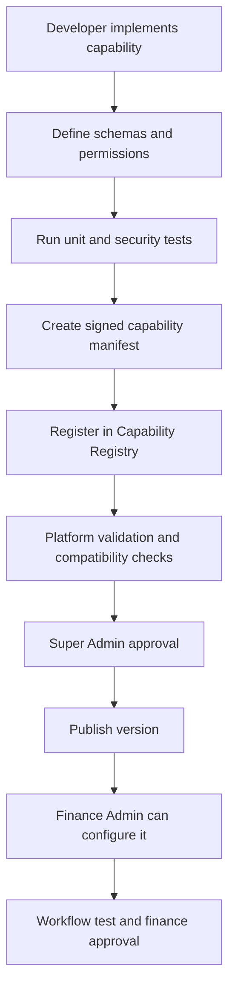

### Security requirements for registered capabilities

- Only trusted Super Admins can register or publish capabilities.
- Capability manifests must be schema-validated and versioned.
- Implementations must be allowlisted; arbitrary URLs are not sufficient.
- Remote capability endpoints should use authentication, TLS, timeouts, and network policy.
- Every capability must declare read-only or side-effect behavior.
- Write operations require a separate permission and approval policy.
- Capability input and output data must be logged according to the audit policy.
- A failed or unavailable capability must produce a controlled error, not an invented result.
- Deprecated versions remain available for historical replay but cannot be selected for new workflows.

---

## 20C. MCP and A2A Integration

MCP and A2A can be integration protocols, but they should not replace the platform's internal registry, authorization, or audit controls.

### MCP

Use MCP when exposing tools, resources, or prompts through a standard tool interface. A calculation engine or rule service can expose a typed MCP tool such as:

```text
subtract_values(value_1: decimal, value_2: decimal) -> result
```

The platform should discover the tool, validate its manifest, map it to an internal capability ID, and enforce its local permission policy before an agent can call it.

### A2A

Use A2A when an independently deployed agent service needs to advertise its capabilities and communicate with the platform or another agent. A7 could expose an A2A capability card describing its purpose, skills, input schema, output schema, authentication requirements, and supported version.

The A2A card is a discovery document, not a security approval. The platform must still:

1. Register the card in the Capability Registry.
2. Verify the service identity and endpoint.
3. Validate its schemas and declared side effects.
4. Apply tool and data-access permissions.
5. Run compatibility and evaluation tests.
6. Approve and publish the capability version.
7. Route all executions through the audit and policy layers.

### Recommended integration pattern

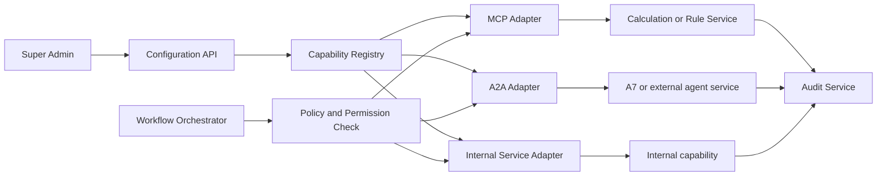

The internal Configuration API and Capability Registry remain the source of truth. MCP or A2A cards are adapters for discovery and communication, not a way to bypass platform governance.

---

## 21. Quality and Evaluation

The platform should be evaluated with representative finance data before production publishing.

### Metrics

- Extraction accuracy
- Field-mapping accuracy
- Account-mapping accuracy
- Match precision
- Match recall
- False-match rate
- False-exception rate
- Reconciliation balance correctness
- Reviewer override rate
- Human review time
- Close-cycle time reduction
- Report citation completeness
- Processing latency
- Processing cost
- Audit replay success
- Workflow recovery success

### Test dataset

Each workflow should include:

- Normal records
- Exact matches
- Partial payments
- Duplicate records
- Missing fields
- Invalid dates
- Different currencies
- Timing differences
- Reversals
- Malformed Excel files
- Scanned PDFs
- Conflicting source values
- Tolerance-boundary values
- High-value exceptions
- Low-confidence extractions
- Unauthorized-user attempts

### Release gate

A workflow is not published until:

```text
Required fields are mapped
Calculations have valid inputs
Rules reference valid fields
Tool permissions are valid
Routing exists for every exception type
Test cases pass
Expected results are reviewed
Audit events are present
Finance owner approves
```

---

## 22. Recommended Implementation Phases

### Phase 1: Foundation

- Define canonical finance data model.
- Define source and evidence contracts.
- Build configuration registry.
- Build audit and lineage model.
- Build role and permission model.
- Define agent input and output schemas.

### Phase 2: A1 and A6

- Build A1 file intake and source preservation.
- Support Excel, CSV, PDF, and SAP exports.
- Build A6 queues, assignments, notifications, and human decisions.
- Build deterministic workflow state around these capabilities.

### Phase 3: Rule and calculation services

- Build typed calculation registry.
- Implement basic arithmetic and finance calculators.
- Build reusable rule operators.
- Add rule versioning and testing.
- Connect tools to agent allowlists.

### Phase 4: Bank-to-GL vertical slice

- Add A2 normalization.
- Add A3 matching.
- Add A4 reconciliation validation.
- Add A5 reconciliation reporting.
- Complete end-to-end test data and audit replay.

### Phase 5: Admin Builder

- Add natural-language workflow suggestion.
- Add structured agent configuration forms.
- Add rule builder.
- Add calculation binding UI.
- Add mapping UI.
- Add test runner.
- Add approval and publishing lifecycle.

### Phase 6: Expansion

Add workflow templates for:

- AP invoice processing
- AR cash application
- Month-end close
- Balance-sheet certification
- Cash-flow analysis
- Budget-versus-actual reporting
- Procurement matching
- Other finance and selected HR/admin workflows

### MVP exclusions

The first production release should explicitly exclude:

- SAP write-back and automatic journal posting.
- Automatic financial approval.
- Tax or statutory filing decisions.
- Complex revenue-recognition judgments.
- Complex foreign-exchange accounting.
- Broad multi-entity rollout before one entity is validated.
- Automatic clearing of low-confidence records.

These capabilities can be considered after the advisory bank-to-GL workflow passes accuracy, audit, security, and human-acceptance gates.

## 22A. POC Quick Start: Five Easy and Different Use Cases

This POC should prove the reusable platform, not attempt to deliver all 40 use cases at once. The five selected use cases exercise five different patterns:

| POC use case | Main pattern proved | Why it is suitable for a first POC |
|---|---|---|
| Bank-to-GL reconciliation | Record matching and exception review | Clear inputs, measurable results, read-only data, and a well-defined finance outcome. |
| Budget-versus-actual analysis | Period comparison and variance explanation | Mostly structured data and calculations; no transaction posting is required. |
| Close-task evidence collection | Workflow, task routing, and human decisions | Proves A6 and the orchestrator without complex accounting calculations. |
| Employee expense review | Document extraction and policy validation | Proves PDF/receipt extraction and rules using bounded policy checks. |
| Cash-flow reporting | Aggregation, classification, chained calculations, and reporting | Proves calculation pipelines and A5 management reporting. |

These are recommended POC candidates, not a promise that all production accounting policy is solved. Each workflow should start with one entity, one reporting currency, a small number of source formats, and advisory-only output.

### Shared POC scope

Build the following capabilities once and reuse them across all five workflows:

```text
A1 file intake for Excel, CSV, PDF, and SAP exports
A2 canonical fields, field mapping, date, currency, and amount normalization
A3 exact matching and configured comparison operations
A4 typed calculations, calculation pipelines, and rule pipelines
A5 evidence-backed tables, summaries, and reports
A6 queues, assignment, notifications, and human decisions
Workflow Orchestrator with state, dependencies, retries, and safe reruns
Master Data Service for accounts, entities, employees, vendors, and calendars
Exception Service for low-confidence and failed cases
Audit and Lineage Service for every source, step, result, and decision
Configuration Registry for immutable published versions
```

The POC should deliberately exclude SAP write-back, automatic journal posting, automatic financial approval, statutory filing, complex tax decisions, and autonomous clearing.

### POC use case 1: Bank-to-GL reconciliation

#### Business purpose

Compare bank transactions and balances with SAP general-ledger transactions, identify matches, and send unexplained differences to a finance reviewer.

#### Inputs

```text
SAP GL export: posting date, amount, currency, assignment, document number
Bank Excel or CSV: value date, amount, currency, reference, description
Optional PDF: bank advice or supporting evidence
```

#### Configuration

```yaml
template: reconciliation
agents: [A1, A2, A3, A4, A5, A6]
matching:
  fields: [amount, reference, transaction_date]
  date_tolerance_days: 3
  amount_tolerance: 1.00
calculations:
  - calculate_amount_difference
  - calculate_date_difference
  - calculate_reconciliation_difference
rules:
  - exact_match_first
  - tolerance_check
  - low_confidence_review
routing:
  unmatched: finance_operations
  high_value: controller
```

#### End-to-end flow

```text
A1 receives SAP and bank files and preserves source snapshots.
A2 maps source columns to canonical transaction fields.
A3 finds exact candidates, then tolerant candidates.
A3 calls amount, date, and match-score calculators.
A4 validates the match and calculates the reconciliation difference.
A6 sends unmatched or low-confidence records to the review queue.
The reviewer accepts, rejects, or corrects the recommendation.
A5 creates the final reconciliation report with evidence.
```

#### Why it is easy for the POC

- Inputs are usually tabular.
- The matching keys are understandable to finance users.
- Tolerances are configurable.
- The result can be measured with match precision and reconciliation balance correctness.
- Read-only exports are sufficient.

#### POC success result

```text
Matched transactions
Unmatched transactions
Difference and tolerance status
Reviewer decisions
Reconciliation report
Complete source-to-result audit trail
```

### POC use case 2: Budget-versus-actual analysis

#### Business purpose

Compare actual financial results with an approved budget and explain material differences by account, entity, cost center, and period.

#### Inputs

```text
SAP actuals: company code, account, cost center, fiscal period, amount
Budget Excel: company code, account, cost center, fiscal period, budget amount
Optional Excel: management commentary or business-driver mapping
```

#### Configuration

```yaml
template: period_comparison
agents: [A1, A2, A4, A5]
comparison_keys: [company_code, gl_account, cost_center, fiscal_period]
calculation_pipeline:
  - id: calculate_variance
    calculator: subtract_values
    input_mapping:
      value_1: actual.amount
      value_2: budget.amount
    output: results.variance
  - id: calculate_variance_percentage
    calculator: calculate_percentage
    depends_on: [calculate_variance]
    input_mapping:
      numerator: results.variance
      denominator: budget.amount
    output: results.variance_percentage
rules:
  - material_variance
  - zero_budget_exception
```

#### End-to-end flow

```text
A1 captures actual and budget files.
A2 harmonizes accounts, cost centers, periods, currencies, and signs.
A4 compares aligned records and runs the variance calculation pipeline.
The Rule Engine flags material or zero-budget variances.
A5 explains the largest movements and produces tables and charts.
```

#### Why it is easy for the POC

- It needs comparison rather than complex transaction matching.
- The calculations are simple, reusable, and deterministic.
- The output is a report, not a posting or approval.
- The chained calculation demonstrates variance followed by percentage.

#### POC success result

```text
Aligned actual and budget records
Variance and variance percentage
Materiality exceptions
Evidence-backed management report
```

### POC use case 3: Close-task evidence collection

#### Business purpose

Collect evidence for month-end close tasks, identify missing support, assign owners, and track completion through approval.

#### Inputs

```text
Close checklist Excel: task, owner, due date, entity, status
Supporting PDFs or Excel files
User comments and completion responses
```

#### Configuration

```yaml
template: close_management
agents: [A1, A2, A5, A6]
required_evidence:
  - task_id
  - owner
  - completion_status
  - supporting_document
rules:
  - required_evidence_present
  - overdue_task
  - owner_response_required
routing:
  incomplete_tasks: task_owner
  overdue_tasks: close_manager
```

#### End-to-end flow

```text
A1 captures the checklist and supporting documents.
A2 maps tasks, owners, entities, periods, and evidence types.
The Rule Engine checks whether required evidence is present.
A6 creates tasks, sends notifications, collects user decisions, and escalates overdue work.
A5 produces the close-status and evidence-completeness report.
```

#### Why it is easy for the POC

- It proves workflow and human review without complicated accounting formulas.
- The checklist provides a clear input and expected output.
- A6, notifications, queue status, escalation, and audit can be tested directly.
- It is safe to run in advisory mode.

#### POC success result

```text
Complete and incomplete task list
Missing-evidence exceptions
Owner and escalation status
Human decision history
Close evidence report
```

### POC use case 4: Employee expense review

#### Business purpose

Extract expense claim data and receipts, validate basic company-policy rules, and route exceptions for manager review.

#### Inputs

```text
Expense claim Excel or form
Receipt PDFs or images
Approved expense-policy document
Employee and cost-center master data
```

#### Configuration

```yaml
template: document_processing
agents: [A1, A2, A4, A5, A6]
required_fields: [employee_id, expense_date, category, amount, currency, receipt]
calculations:
  - calculate_expense_total
  - calculate_policy_variance
rules:
  - receipt_required
  - category_limit_check
  - duplicate_receipt_check
  - valid_expense_date
routing:
  policy_exception: manager
  missing_receipt: employee
```

#### End-to-end flow

```text
A1 extracts claim fields and receipt values with confidence scores.
A2 maps employee, category, currency, date, amount, and cost-center fields.
A4 applies approved policy rules and calculates any limit variance.
A6 routes missing receipts and policy exceptions to the correct reviewer.
A5 creates an expense review summary with receipt evidence.
```

#### Why it is easy for the POC

- Policy limits can be expressed as simple structured rules.
- It demonstrates PDF extraction without requiring SAP write-back.
- Human approval is naturally required for exceptions.
- The POC can use a small controlled receipt dataset.

#### POC success result

```text
Extracted expense records
Policy pass or exception result
Receipt evidence links
Reviewer decisions
Expense review report
```

### POC use case 5: Cash-flow reporting

#### Business purpose

Classify cash-related GL activity, calculate operating, investing, and financing totals, compare cash flow with budget, and explain material movements.

#### Inputs

```text
SAP GL export
Bank balance Excel
Cash-flow category mapping
Budget or forecast Excel
```

#### Configuration

```yaml
template: analysis_and_reporting
agents: [A1, A2, A4, A5, A6]
calculation_pipeline:
  - id: calculate_operating_cash
    calculator: calculate_sum
    input_mapping:
      values: canonical.operating_cash_items
    output: results.operating_cash
  - id: calculate_investing_cash
    calculator: calculate_sum
    input_mapping:
      values: canonical.investing_cash_items
    output: results.investing_cash
  - id: calculate_financing_cash
    calculator: calculate_sum
    input_mapping:
      values: canonical.financing_cash_items
    output: results.financing_cash
  - id: calculate_total_cash_flow
    calculator: add_values
    depends_on: [calculate_operating_cash, calculate_investing_cash]
    input_mapping:
      value_1: results.operating_cash
      value_2: results.investing_cash
    output: results.partial_cash_flow
rules:
  - cash_category_required
  - bank_to_gl_balance_check
  - material_cash_variance
```

#### End-to-end flow

```text
A1 captures GL, bank, budget, and mapping files.
A2 normalizes accounts, currencies, periods, and cash-flow categories.
A4 runs the calculation pipeline and applies category and balance rules.
A6 routes unmapped accounts or material cash differences for review.
A5 generates the cash-flow report and explains the largest movements.
```

#### Why it is easy for the POC

- It demonstrates aggregation and chained calculations without transaction posting.
- The category mapping can start with a small approved account list.
- The output is a report and exception list.
- It exercises A5 with a useful management-facing result.

#### POC success result

```text
Cash-flow category totals
Opening and closing cash comparison
Budget or forecast variance
Unmapped-account exceptions
Evidence-backed cash-flow report
```

### POC delivery sequence

Build the five workflows in this order:

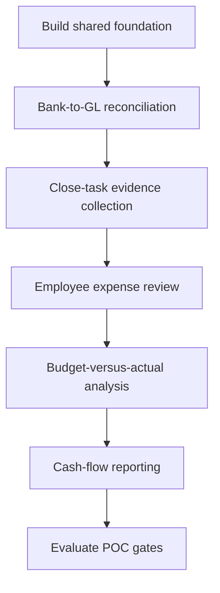

1. Build A1, A2, A4, A5, A6, the orchestrator, and shared services.
2. Implement bank-to-GL to prove matching and exception review.
3. Implement close-task evidence to prove queues, decisions, and escalation.
4. Implement expense review to prove document extraction and policy rules.
5. Implement budget-versus-actual to prove period comparison and chained variance calculations.
6. Implement cash-flow reporting to prove aggregation and management reporting.
7. Compare all five workflows against the same audit, security, reliability, and configuration standards.

### POC acceptance gates

The POC is successful only when:

```text
An admin can configure each workflow without code changes.
Existing calculators and rules can be reused with different field mappings.
At least one chained calculation pipeline runs correctly.
At least one chained rule pipeline routes a human review.
Every output has source and configuration lineage.
Repeated input does not create duplicate results or tasks.
Unauthorized users cannot access data or tools outside their scope.
Human decisions are recorded and included in final reports.
Workflow failures can be retried or routed without losing state.
Finance users accept the results against known sample data.
```

---

## 23. Open Decisions Before Implementation

These decisions should be confirmed before building production integrations:

1. SAP version and access method: read-only exports, APIs, or both.
2. On-premises deployment topology and approved local LLM strategy.
3. First source-file formats and sample files.
4. Canonical finance data model.
5. First business entity, company code, currency, and fiscal calendar.
6. First reconciliation type and expected volume.
7. Human approval roles and segregation-of-duties requirements.
8. Retention and audit requirements.
9. Model provider and model evaluation process.
10. Whether future versions may auto-clear low-risk records.
11. Whether and when SAP write-back is permitted.
12. Required finance reporting and export formats.

Recommended initial decision:

```text
Workflow: bank-to-GL reconciliation
Deployment: on-premises
SAP access: read-only export first
Automation: advisory-only
Human review: required for all exceptions
Write-back: disabled in initial release
```

---

## 24. Final Architecture Decision

The final design is:

```text
A1 Capture
A2 Structure and Harmonize
A3 Match and Reconcile
A4 Validate and Recommend
A5 Generate and Explain
A6 Route and Coordinate

+ Workflow Orchestrator
+ Reusable Rule Engine
+ Reusable Calculation Engine
+ Master Data Service
+ Exception Service
+ Audit and Lineage Service
+ Security and Permissions
+ Admin Agent Builder
```

The responsibilities are deliberately separated:

```text
LLM:
- Understand admin requests
- Extract difficult documents
- Suggest mappings
- Recommend matches
- Explain trusted results

Deterministic services:
- Calculate
- Evaluate rules
- Control permissions
- Manage workflow state
- Record audit evidence
- Enforce approvals
```

The platform succeeds when a finance administrator can create a new configured workflow by selecting existing capabilities, mapping different columns, choosing approved rules and calculations, testing the result, and publishing a controlled version without developer work.

> Developer creates reusable capabilities. Finance admin configures them. The workflow orchestrator controls execution. Humans make controlled decisions. The audit service records the evidence.

--
## 25. Market Research and Competitive Landscape

Finance automation is an established market. Similar products already provide parts of this vision, especially financial close, account reconciliation, transaction matching, invoice automation, process intelligence, task management, and connected reporting.

This comparison uses publicly available product information from official vendor pages. A `Yes` means the vendor publicly describes the capability; `Partial` means the capability exists in a narrower product area or with a different implementation; `Not evident` means it was not identified on the reviewed public page. `Not evident` does not prove that a vendor cannot provide the capability. Product packaging, licensing, deployment, and feature availability must be confirmed directly with each vendor.

### Market categories

| Category | Representative products | Main strength |
|---|---|---|
| Financial close and reconciliation | [BlackLine](https://www.blackline.com/products/financial-close/), [Trintech](https://www.trintech.com/products/financial-close/), [FloQast](https://www.floqast.com/solutions/close-management) | Close management, reconciliations, transaction matching, controls, and task visibility. |
| ERP-native finance automation | [SAP Advanced Financial Closing](https://www.sap.com/products/financial-management/advanced-financial-closing.html), [SAP Cash Application](https://www.sap.com/products/financial-management/cash-application.html) | Deep SAP process integration, close orchestration, receivables matching, and ERP workflows. |
| Finance AI and spend automation | [AppZen Mastermind](https://www.appzen.com/platform) | AI agents, invoice and receipt processing, spend classification, compliance, and low-code finance workflows. |
| Process intelligence | [Celonis Finance](https://www.celonis.com/solutions/finance/) | Process mining, bottleneck discovery, process optimization, and working-capital improvement. |
| Connected reporting and compliance | [Workiva Financial Reporting](https://www.workiva.com/solutions/financial-reporting) | Linked data, financial reporting, disclosures, audit trails, collaboration, and reporting controls. |

### Comparative feature matrix

The following table compares the market direction with this platform's planned architecture. `Our platform` describes the intended capability, not a currently shipped feature.

The finance comparison below is complemented by a separate horizontal-agent table later in this section. The second table is important because Microsoft, open-source frameworks, and workflow platforms provide reusable agent-building foundations rather than finance-specific applications.

| Product or platform | Close and reconciliation | Transaction matching | AP, invoice, or spend automation | AI or agent features | Admin-configurable workflows | Chained calculations and rules | Human review and approvals | Audit and lineage | SAP focus | On-premises option | Main market position |
|---|---|---|---|---|---|---|---|---|---|---|---|
| [BlackLine Financial Close](https://www.blackline.com/products/financial-close/) | Finance: close, R2R, consolidation | Yes | Yes | Partial; accruals and related close capabilities | Yes; Verity AI and intelligent digital workers | Partial; configurable templates and rules | Not evident as an admin calculation DAG | Yes | Yes | Yes; Smart Close for SAP | Confirm with vendor | Broad close, reconciliation, matching, journals, consolidation, reporting, and compliance. |
| [Trintech Financial Close](https://www.trintech.com/products/financial-close/) | Finance: close, reconciliation, reporting | Yes | Yes | Partial | Yes; AI accounting and agentic close messaging | Partial; product workflows and automation | Not evident as a general-purpose chained calculation builder | Yes | Yes | Enterprise finance integrations | Confirm with vendor | Close management, transaction matching, reconciliations, reporting, and controls. |
| [FloQast Close](https://www.floqast.com/solutions/close-management) | Finance: close management | Yes; close management | Partial | Not primary focus | Partial; intelligent checklist and AI-assisted setup | Not evident | Yes | Yes | ERP integrations | Confirm with vendor | Close checklist, task ownership, dashboards, collaboration, and close visibility. |
| [HighRadius R2R](https://www.highradius.com/solutions/record-to-report/) | Finance: R2R and shared services | Yes | Yes; reconciliation focus | Partial | Yes; LiveCube agents and ML automation | Partial; no-code Excel-like platform, general pipeline not established | Yes | Yes | Strong R2R and reconciliation focus | Enterprise ERP integrations | Confirm with vendor | Record-to-report automation, reconciliation, close, variance analysis, and journal automation. |
| [SAP Advanced Financial Closing](https://www.sap.com/products/financial-management/advanced-financial-closing.html) | Yes; close and account substantiation | Partial | Not primary focus | Yes; closing templates, sequencing, dependencies, and reuse | Not evident as a general-purpose calculation/rule pipeline | Yes | Yes | Yes | Yes; native SAP orientation | Yes; on-premises S/4HANA ecosystem exists, product edition must be confirmed | SAP-centered close planning, execution, monitoring, and compliance. |
| [SAP Cash Application](https://www.sap.com/products/financial-management/cash-application.html) | Finance: AR and cash application | Partial; receivables reconciliation | Yes; incoming payment to open invoice | Partial | Yes; embedded machine learning | Not evident as a general-purpose pipeline | Yes | Yes | SAP-centered | Mixed cloud/on-premises integration model | Receivables matching, payment advice extraction, and clearing recommendations. |
| [AppZen Mastermind](https://www.appzen.com/platform) | Finance: AP, spend, expenses, compliance | Partial | Partial | Yes; invoices, POs, receipts, expenses, and compliance | Yes; AI agents and finance models | Yes; low-code/no-code finance workflow positioning | Not evident as a governed finance calculation DAG | Yes | Security and control claims; exact lineage scope requires confirmation | Integrations include major enterprise finance systems | Confirm with vendor | Finance AI agents, spend automation, document understanding, and compliance. |
| [Celonis Finance](https://www.celonis.com/solutions/finance/) | Horizontal process intelligence: AP, AR, procurement | Partial; process insight rather than close product | Partial | Partial; AP/AR/procurement process intelligence | Yes; AI connected to process context | Partial; apps and process actions, not the same as our Agent Builder | Not evident | Workflow actions and process coordination | Process event lineage | ERP-agnostic process intelligence | Confirm with vendor | Process mining, bottleneck discovery, AP/AR/procurement optimization, and working capital. |
| [Workiva Financial Reporting](https://www.workiva.com/solutions/financial-reporting) | Finance, audit, risk, and regulated reporting | Partial; reporting and controls | Not primary focus | Not primary focus | Yes; AI for insights and draft disclosures | Partial; connected reporting workflows | Not evident as a finance calculation engine | Yes | Yes; linked data and audit trails | ERP and data integrations | Confirm with vendor | Connected financial reporting, disclosures, collaboration, and compliance. |
| **Our Configurable Finance Operations Platform** | Planned; bank-to-GL first, then broader finance | Planned; A3 matching | Planned; AP and procurement use cases | Planned; bounded A1-A6 agents and optional A7 | **Core differentiator planned**; Super Admin capabilities plus Finance Admin configuration | **Core differentiator planned**; typed calculation and rule DAGs | **Core requirement**; A6 queues and human decisions | **Core requirement**; source-to-result lineage and immutable versions | Planned; SAP exports first, APIs later | **Target deployment**; on-premises first | One governed configuration platform spanning capture, harmonization, matching, validation, explanation, and human coordination. |

### Open and horizontal agent-template landscape

These products and frameworks are not direct finance competitors in every case. They are relevant because they show how reusable agents, tools, templates, workflows, and multi-agent systems are built for general domains.

| Platform | Domain | Agent/template model | Tools and integrations | Orchestration and human control | Publishing or deployment | What it demonstrates for this platform |
|---|---|---|---|---|---|---|
| [Microsoft Foundry Agent Service](https://learn.microsoft.com/en-us/azure/ai-services/agents/overview) | Horizontal enterprise: finance, HR, IT, operations, customer service, and custom domains | Prompt agents configured with instructions, models, and tools; hosted agents for custom code and frameworks. | Toolboxes, functions, OpenAPI, MCP, file search, code interpreter, web search, and custom tools. | Managed runtime, tool governance, RBAC, identity, tracing, evaluations, and support for custom orchestration. | Managed endpoints, versioning, stable publishing, Entra Agent Registry, Teams, Microsoft 365, and A2A preview. | Strong reference for Super Admin capability registration, tool allowlists, prompt versus hosted agents, versioning, and enterprise governance. |
| [Microsoft Copilot Studio](https://learn.microsoft.com/en-us/microsoft-copilot-studio/add-tools-custom-agent) | Horizontal business: Microsoft 365, customer service, internal operations, and departmental processes | Agents configured with prompts, topics, agent flows, and tools; makers can build through a visual UI. | Connectors, REST APIs, MCP, agent flows, prompts, computer use, client tools, and Power Platform integrations. | Generative orchestration or explicit topics; input validation, confirmation, user/maker authentication, and adaptive-card responses. | Publish and share through Microsoft channels and business applications. | Strong reference for the proposed admin UI: tool pages, input tables, dropdowns, prompt configuration, enable/disable toggles, and publish flow. |
| [LangGraph](https://www.langchain.com/langgraph) | General software applications: research, customer support, data workflows, and custom domains | Code-first stateful graphs supporting single-agent, multi-agent, and hierarchical workflows. | Model providers, tools, memory, custom functions, and framework integrations. | Durable state, streaming, human-in-the-loop interrupts, conditional edges, and explicit control flow. | Open-source runtime with LangSmith tracing, evaluation, and deployment options. | Strong reference for deterministic workflow graphs, conditional branches, state, human review, and separating agent reasoning from orchestration. |
| [CrewAI](https://docs.crewai.com/introduction) | General business automation, research, content, and custom domains | Crews contain role-based collaborating agents; Flows define state, events, logic, and execution. | APIs, databases, local tools, and custom tools. | Flow controls state and branching; Crew agents collaborate and delegate tasks. | Production-oriented framework with reusable Flows and Crews; exact hosting depends on deployment choice. | Strong reference for separating a process definition from specialized agent teams, similar to our orchestrator plus A1-A6 capabilities. |
| [n8n AI Agent Builder](https://n8n.io/ai-agents/) | General workflow automation: business operations, research, RAG, CRM, and custom domains | Visual workflows, AI Agent nodes, reusable templates, and multi-agent workflows. | 500+ integrations, HTTP, code nodes, LLMs, vector stores, MCP, and other agents. | Conditional logic, human approval, fallback handling, inline logs, evaluations, and cost controls. | Cloud and self-hostable deployment; workflow templates can be shared and reused. | Strong reference for visual admin-style workflow building, integrations, deterministic steps around AI, and self-hosting. |
| **Our platform** | Finance-first, then HR/admin and general operations | Configuration-first A1-A6 capabilities, workflow templates, Super Admin extensions, and optional A7. | SAP, Excel, CSV, PDF, approved calculators, rule engine, MCP, A2A, and future connectors. | Deterministic orchestrator, chained calculations and rules, A6 queues, approvals, exceptions, and immutable audit lineage. | On-premises-first target with Configuration API, Capability Registry, versioned publishing, and controlled user access. | Combines horizontal builder ideas with finance-specific controls, canonical data, evidence, calculations, and audit requirements. |

### Microsoft agent-creation reference

Microsoft's current agent platform illustrates a useful distinction for our design:

```text
Prompt agent:
  Configure instructions, model, and tools in a portal or API.

Hosted agent:
  Developer supplies custom code and orchestration; the platform hosts it.

Our equivalent:
  Finance Admin configures a published A1-A6 capability.
  Super Admin supplies new code, calculators, rules, connectors, or A7.
```

Microsoft Copilot Studio also demonstrates a practical maker experience: tools can be added at agent level, inputs can be configured in a table, tools can be enabled or disabled, authentication can be selected, and the result can be tested before publication. These patterns support the proposed Admin Configuration UX, but our platform must add finance-specific schema validation, rule/calculation versioning, audit lineage, and approval controls.

### Open framework versus domain product

| Choice | Strength | Limitation for this platform |
|---|---|---|
| Finance product | Ready-made finance workflows, controls, and domain terminology. | Usually narrower configuration model and less freedom to create cross-domain capabilities. |
| General agent framework | Flexible orchestration, tools, memory, and custom domains. | Requires us to build finance data models, controls, audit, exceptions, and admin UX. |
| Workflow automation platform | Fast visual composition, integrations, templates, and human tasks. | Financial calculations, lineage, segregation of duties, and specialist accounting controls may need custom implementation. |
| Our proposed platform | Finance-first controlled configuration plus extensible general capabilities. | Must prove that the extra platform scope creates better results than combining an existing framework with finance products. |

The practical recommendation is to reuse proven framework patterns where they help, but keep the finance control plane proprietary to this design: canonical data, calculation and rule contracts, change-impact levels, exception evidence, approval controls, and audit replay.

### What the market already proves

- Close and reconciliation automation is commercially validated.
- Finance teams value reusable templates, task ownership, dashboards, exception handling, and auditability.
- Transaction matching and document extraction are established use cases for AI and machine learning.
- SAP integration is strategically important for enterprise finance deployments.
- Process intelligence and connected reporting address adjacent parts of the finance operating model.
- Human oversight remains important for material, ambiguous, or policy-sensitive cases.

### Potential differentiation for this platform

The platform should not compete only by claiming “AI for finance.” Its potential differentiation is the combination of:

1. One reusable A1-A6 capability model across many finance workflows.
2. Finance Admin configuration through structured forms instead of developer work for normal variations.
3. Super Admin extension of new agents, calculators, rules, connectors, MCP tools, and A2A services.
4. Typed, versioned calculation pipelines where one result can feed another calculation.
5. Typed, versioned rule pipelines where rules can consume calculation and earlier rule results.
6. A single impact model from L1 prompt changes through L5 new platform capabilities.
7. On-premises-first deployment for organizations with sensitive SAP and finance data.
8. Source-to-result lineage covering files, mappings, calculations, rules, agent versions, human decisions, and final reports.

These are design hypotheses that must be validated with finance users and buyers. They are not automatically a sustainable competitive advantage. The POC should test whether admins can actually configure workflows faster and more safely than existing spreadsheets, scripts, or specialist products.

### Market gaps to test, not assume

The comparison suggests opportunities, but the following questions require product interviews and hands-on trials:

- Can a finance user configure a genuinely new workflow without vendor professional services?
- Can one product combine document capture, reconciliation, calculations, rules, human review, and reporting across unrelated finance processes?
- Are calculation and rule dependencies visible, versioned, testable, and auditable for finance administrators?
- How much configuration is available in standard licensing versus custom implementation?
- Which products support on-premises processing of sensitive documents and local model deployment?
- How are SAP, spreadsheet, PDF, and non-ERP sources combined in one controlled workflow?
- Can historical results be replayed exactly after a rule, prompt, model, or mapping change?

### Market research links

Use these official pages to inspect product scope, demos, documentation, integrations, and security information:

- [BlackLine Financial Close](https://www.blackline.com/products/financial-close/)
- [BlackLine Account Reconciliations](https://www.blackline.com/products/financial-close/account-reconciliations/)
- [BlackLine Transaction Matching](https://www.blackline.com/products/financial-close/transaction-matching/)
- [Trintech Financial Close](https://www.trintech.com/products/financial-close/)
- [FloQast Close Management](https://www.floqast.com/solutions/close-management)
- [HighRadius Record-to-Report](https://www.highradius.com/solutions/record-to-report/)
- [SAP Advanced Financial Closing](https://www.sap.com/products/financial-management/advanced-financial-closing.html)
- [SAP Cash Application](https://www.sap.com/products/financial-management/cash-application.html)
- [AppZen Mastermind AI Automation Platform](https://www.appzen.com/platform)
- [Celonis Finance Process Intelligence](https://www.celonis.com/solutions/finance/)
- [Workiva Financial Reporting](https://www.workiva.com/solutions/financial-reporting)

Market information changes frequently. Recheck feature pages, licensing, deployment model, regional availability, and product documentation before making a procurement or competitive decision.
--